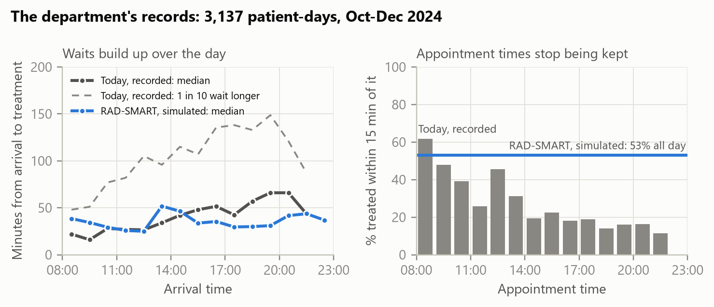
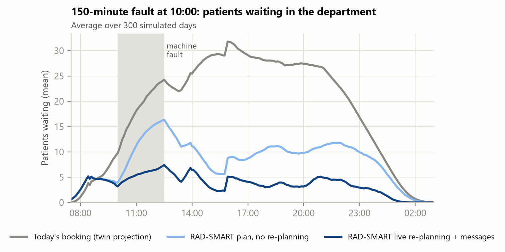

# RAD-SMART: Research Report and Implementation Plan

**Radiotherapy AI-assisted Dynamic Scheduling, Machine Allocation and Resource Tracking**

Health-a-thon 2026 · Cancer track · Doctor / care-team facing use case 04: Clinic Operations & Patient Flow

Team leader, problem owner and doctor partner: Dr Akshay Dinesan, Manipal · Technical lead: Abhinand T M · Team: P S Raghotham Rao, Dr Shirley Lewis Salins, Dr Umesh Velu · Version 1.2, 22 September 2026 (updated with the department's records)

> **Assistive, not diagnostic.** RAD-SMART plans *when* and *on which machine* a session takes place. It never decides whether, how or how much a patient is treated. Urgency, technique and machine eligibility are always entered by clinicians and physicists, every plan is a proposal until a person approves it, and every action is logged. The prototype's patients are synthetic. Today's waiting times come from the department's anonymised records (October–December 2024) and are reported only as aggregates.

---

## 1. Executive summary

**The problem.** A radiotherapy machine treats 70–90 patients a day, most of them every working day for weeks. In our department one Versa HD runs from 08:30 until about 01:00 in three RTT shifts, with a ceiling of 90 patients a day, and a second machine arrives in early 2027. Radiation therapy technologists (RTTs) give out appointment times by hand, without a measure of how many machine-minutes each patient actually needs. Too many patients are told to come at the same time, so they wait, every day of a 5–7 week course. The department's own records (55 days, October–December 2024, 3,137 patient-days) show how: the median wait from arrival to treatment is 34 minutes, but one patient in ten waits more than 109 minutes, 22% are treated more than an hour after their appointment and only 29% within 15 minutes of it. Delays build through the day, from about 19 minutes for patients arriving before 10:00 to about 66 minutes after 19:00, and evening patients now come about 32 minutes early to protect their place. The department must also finish new starts by 17:00, keep complex procedures inside 10:00–17:00 while senior staff are present, keep 13:30–14:00 for blood irradiation, share one breast board and one ABC unit with the CT simulator, treat MHRC patients in time for the 17:00 hospital bus, get public-transport patients home by 21:00, fit same-day urgent starts before 18:00, run total body irradiation (TBI) courses, and recover from machine faults. As the problem statement says, this is not appointment booking. It is dynamic allocation of machine time, staff and shared resources under many constraints.

**Our answer.** RAD-SMART is an operational layer between the patient list and the machines, built as a hybrid AI system with four parts:

1. **Predict.** A machine-learning model predicts each session's machine-minutes: the expected value used for planning and a cautious value (P80) used to flag fragile plans. The department records arrival and treatment-start times but not how long each session takes, so RAD-SMART starts from the department's own estimate table and learns once room entry and exit are captured.
2. **Optimise.** A constraint-optimisation engine turns those minutes into a minute-level plan for each machine. Hard rules cannot be broken, because the solver will not produce a plan that breaks them, and an independent checker re-verifies every plan. These rules include new starts by 17:00, complex cases in 10:00–17:00, the blood slot, MHRC slots and the 17:00 bus, public transport home by 21:00, and one breast board and one ABC unit shared with the CT simulator.
3. **Simulate.** A digital twin of the department stress-tests every plan against late arrivals, overruns, urgent starts, imaging holds and machine faults. The same engine gives a three-week machine-load forecast that plans new starts around TBI courses, and advises two days ahead how many new patients to start on each machine.
4. **Explain and converse.** A copilot on Sarvam AI's Indian-language models explains every placement in plain language and turns rule changes typed in plain language into versioned, validated configuration. It sends patients and caregivers their reporting time and live updates by WhatsApp, SMS or voice call, in Kannada, Tulu, Malayalam, Hindi or English. The copilot never makes a scheduling decision.

**The evidence so far.** We built a working proof of concept (PoC) in Python. Its patients are synthetic, its rules are the department's (answers of 21 September 2026), and its digital twin is calibrated on the department's records: how appointment times are spread over the day and how early patients arrive at each hour. The test is an 87-patient day on the Versa HD from 08:30 to 01:00, 10 more patients than the busiest recorded day, loaded to 92.7% and simulated 300 times with realistic randomness. We compare it with the department's busiest recorded days (70–77 patients).

| What we measured | Today (department records, 70–77-patient days) | RAD-SMART (simulated, 87 patients) |
|---|---|---|
| Median wait from arrival to entering the treatment room | 38 min | 36 min |
| 90th-percentile wait (one patient in ten waits longer) | 130 min | **76 min (−42%)** |
| Treated more than 1 hour after the appointment | 27% | **6%** |
| Treated within ±15 min of the appointment | 30% | **53%** |
| Median wait, arriving before 10:00 / after 19:00 | 19 / 66 min (all recorded days) | 36 / 36 min |
| Hard rules in the evening plan (independent check) | not checked | **all 7 met** |
| 45-minute fault at 11:00: median wait without → with live re-planning | – | 53 → **39 min**, re-planned in 2 s; 1 new start proposed for the next day |
| 150-minute fault at 10:00: median wait without → with live re-planning | – | 104 → **36 min**; 5 new starts moved to the next day |
| Two machines and a TBI week: peak planned load | 154% on the Versa HD (equal head-count, simulated) | **98% and 99%** |

Four findings matter most for a real rollout.

1. **Fewer long waits and kept times, not a shorter typical wait.** The median stays about where it is on today's busiest days, because every patient is asked to report 20 minutes early (45 for pelvic patients). What changes is the tail and punctuality: the 90th-percentile wait falls from 130 to 76 minutes, the share treated more than an hour late from 27% to 6%, and waits no longer build up in the evening: morning patients wait a little longer than today, because they allow 20 minutes to prepare, and evening patients far less. If patients keep arriving as early as they do today, the 90th percentile is 110 minutes, but lateness still falls: 5% are treated more than an hour late.
2. **Benefits from day one.** The optimiser using only average durations already gets the 90th-percentile wait to 82 minutes, so the department benefits before any durations are recorded. Machine learning then adds punctuality (48.9% → 52.9% within ±15 minutes).
3. **The department chooses when the day ends.** Holding 40 minutes for urgent starts gives the shortest waits, with the last patient finishing at 01:03. Holding nothing ends the day at 00:49, with a 90th-percentile wait of 88 minutes.
4. **Rules and recovery.** Every hard rule held in every plan, and both downtime re-plans follow the department's own rules.

**The pilot.** 90 days on the Versa HD:

- two weeks adding room entry and exit taps to the arrival and treatment times the department already records, to refresh the baseline;
- three weeks in shadow mode;
- eight weeks live, with a designated senior RTT or oncologist approving every plan.

The primary KPI is the 90th-percentile wait from arrival to linac entry, the long waits patients remember, with a target reduction of at least 25% (from 109 minutes in the records). Punctuality is the main secondary KPI: patients treated more than an hour after their appointment, from 22% to 10% or fewer. It needs about ₹2–3 lakh of hardware and messaging costs and works with the Excel lists, paper registers and WhatsApp the department already uses.

**Why this can win.** It solves a daily, high-frequency pain for thousands of patients and their caregivers. It uses AI where each technique is strongest: machine learning to predict, mathematical optimisation to guarantee, simulation to test, and a language model to explain and talk to people. It stays inside the hackathon's guardrails by design, it is built on the department's own rules and calibrated on its own records, and it already produces results rather than a mock-up.

<!-- pagebreak -->

## 2. The problem and why it matters

### 2.1 What happens today

Radiotherapy differs from a normal outpatient clinic. A patient attends every working day for 1–2 weeks (palliative) or 5–7 weeks (curative), so one machine carries 70–90 patients a day. It has to absorb new starts, urgent palliative patients who must start the same day as their consultation, and complex procedures such as SBRT, SRT, TBI and CSI. A routine session occupies roughly 7–15 minutes of machine time, while a new start or complex procedure takes 20–60 minutes.

Appointment times are given by hand. They are not based on how long each treatment takes or how loaded the machine is. As a result, too many patients are asked to report in the same period and other periods sit under-used. Patients have an appointment yet still face long, unpredictable waits.

**Our department.** One Elekta Versa HD runs from 08:30 until about 01:00–02:00 in three RTT shifts, with an operational ceiling of 90 patients a day. A second machine arrives in early 2027, and its capability matrix is still being agreed. Most patients speak Kannada or Tulu; a few speak English, Hindi or Malayalam. The department records appointment, arrival and treatment-start times, but not how long sessions take.

**What the department's records show.** The department shared anonymised arrival and treatment records for 55 days, 15 October to 31 December 2024: 3,137 patient-days for 263 patients. The system writes 12:00 AM when a time is missing, so we treat those entries as missing. We fix 3 obvious AM/PM slips and drop 36 impossible entries (a treatment recorded before arrival), which leaves 2,685 waits. We use only aggregates.

{width=6.7}

- **Waits.** The median wait from arrival to treatment is 34 minutes and the mean 47 minutes. One patient in ten waits more than 109 minutes; 30% wait over an hour and 7% over two hours. For comparison, Munshi et al. report a mean of 37.4 minutes at a two-linac centre with barcode check-in [3].
- **Delays build through the day.** The median wait is about 19 minutes for patients arriving before 10:00 and about 66 minutes for those arriving between 19:00 and 21:00.
- **Appointment times stop being kept.** Overall 29% of patients are treated within 15 minutes of their appointment: 62% of 08:00 appointments but only 12–16% in the evening. 22% are treated more than an hour late.
- **Patients adapt by coming early.** They arrive a median of 19 minutes before their appointment: about 10 minutes for a morning appointment and about 32 for an evening one. Part of the evening wait is this defensive early arrival.
- **Volume is rising, and busy days are worse.** Weekdays averaged 54 patients in October and 67 in December; the busiest day had 77. On days with 70–77 patients the 90th-percentile wait is 130 minutes and 27% are treated more than an hour late. The last patient is usually treated around 22:38.

### 2.2 Constraints the plan must respect

The problem statement lists the rules, and the department confirmed and extended them on 21 September 2026 (Appendix B). We classify each as hard (never broken) or soft (traded off), and every one of them is editable configuration, not code.

| Rule (department's answer) | Type | How RAD-SMART treats it |
|---|---|---|
| Operating day 08:30 to about 01:00–02:00, three RTT shifts, ceiling of 90 patients a day | Hard | Regular day to 01:00; overtime penalised; hard stop at 02:00 |
| Complex treatments (SBRT, SRT, TBI, CSI) need senior staff, 10:00–17:00 | Hard | Session starts and ends inside the window, with a 25-min safety buffer |
| Protected complex slot 12:00–13:30 | Soft, released if unused | Complex cases are pulled into it; other patients use it when no complex case needs it |
| New starts completed by 17:00 | Hard | Planned to finish at least 25 min before the cut-off (buffer configurable) |
| Urgent same-day starts: 0–3 a day, arriving in the afternoon | Hard: treated before 18:00 | Two 20-min holds (14:40 and 17:00) that ward and dormitory patients can use on standby; used for catch-up if nobody needs them |
| Blood irradiation, every day on the Versa HD, 13:30–14:00 | Hard | Machine blocked |
| One breast board and one ABC unit, shared with the CT simulator (open 11:00–18:00); transfer under 2 min | Hard | Counted per unit, with CT-simulator bookings, the 2-min transfer and the linac's reservations (Section 6.7) |
| Paying patients get their preferred time as far as possible | Hard for the department; modelled as a strong preference | Four times the normal weight, 15-min tolerance; the plan reports how many got their time |
| MHRC patients: protected 16:00–17:00 slots; must finish for the 17:00 hospital bus | Hard; slots released if unused | Treated between 16:00 and 16:45 after the bus arrives at 15:45 |
| Public-transport patients finish before 21:00 | Hard | Latest end 21:00 |
| Older patients: earlier or convenient slots | Soft | Cost for every minute after 13:00 |
| Inpatients, dormitory residents and patients living nearby are flexible | Soft | They take the late-evening slots; when the machine runs ahead, ward and dormitory patients are called in and nearby patients get a "come early" message |
| Patients report at least 20 min before their slot; pelvic patients (cervix, endometrium, rectum, anal canal, bladder) drink 500 mL of water, wait 30 min and report 45 min before | Instruction to patients | Every message gives the reporting time and preparation; waits are measured from arrival, so they include it |
| Imaging review: the oncologist may decline to treat; the patient is repositioned and treated at once or later the same day | Event; buffer needed | Re-queued automatically; the urgent holds and the late evening absorb re-treatments |
| TBI: two fractions a day of 60–90 min (first in the morning and in the evening), about every 2–3 months, known a month ahead; new starts tapered from a week before | Hard (planned) | Slots blocked on TBI days; the forecast holds back exactly the new starts that would not fit |
| Machine capability (Versa HD, second machine from early 2027) | Hard | Eligibility matrix from physics; pending departmental consensus |
| Machine downtime: 30–60 min, and over 120 min | Event with rules | The department's downtime rules (Section 6.5) |
| Staff overtime | Soft | Penalised in the objective |
| Approval of the next-day plan and of live changes | Human | A designated senior RTT or oncologist approves |

### 2.3 Evidence from India and elsewhere

- **Waiting is a daily, measurable burden.** An audit of 34,438 sessions at an advanced Indian centre with two linacs and barcode check-in found a mean gross wait (arrival to linac entry) of 37.4 minutes and a mean total time in the department of 52.4 minutes on routine days. Mean set-up plus treatment time was only 15.1 minutes [3]. Centres without digital queueing report much longer waits. At Tata Memorial Centre, a quality-improvement project cut the median first-day wait from 6 to 4.5 hours [5].
- **Communication is the best-rated fix.** A survey of Indian radiation oncology departments identified two-way communication with patients as the most effective waiting-time strategy [4].
- **Capacity is scarce, so every minute counts.** India has about 823 radiotherapy machines, roughly 0.6 per million people, with a shortfall estimated at 1,209 machines. 69% of the 554 facilities have only one machine [6], which means one bad day on that machine affects every patient in the centre.
- **Repetition multiplies the harm.** A patient waiting an extra hour a day on a 25-fraction course loses about 25 hours, and so does the caregiver who usually comes with them.

### 2.4 What changes if we solve it

For patients, the plan means predictability: they arrive close to their real treatment time and hear about delays before they leave home. RTTs no longer have to juggle times by hand or reshuffle the queue after every disruption. Clinicians get complex procedures reliably placed while supervision is available. The department gets smoother machine use, less overtime, objective new-start planning and data for future capacity decisions.

## 3. Fit with Health-a-thon 2026

| Hackathon expectation | How RAD-SMART meets it |
|---|---|
| Non-clinical, operational workflow problem | Scheduling, queueing and resource tracking. It uses operational tags only: technique, fraction number, accessories, logistics flags |
| Out of scope: diagnosis, treatment recommendations, clinical decision support, risk scoring, interpretation of medical data | It does not read images, doses, diagnoses or notes, and it does not decide urgency or eligibility. Clinicians and physicists enter those |
| Human override on every automated step | Every plan and re-plan is a proposal; a designated senior RTT or oncologist approves or edits it in one tap and the reason is captured |
| Audit trail | Append-only log of plans, edits, overrides, rule versions, messages and model versions |
| Measurable KPI with baseline | 90th-percentile wait from arrival to linac entry; the baseline is already in the department's records and is refreshed in the pilot's first two weeks; secondary and balancing KPIs in Section 8 |
| Pilot evidence in 60–90 days | 90-day plan: baseline, shadow mode, then live, analysed as an interrupted time series |
| Light integration; works with paper, Excel, WhatsApp | Imports the Excel list or a photo of the paper register. QR check-in. OIS integration only in phase 2, read-only |
| Multilingual and caregiver-friendly | Messages in the patient's language by WhatsApp, SMS or voice, with an optional caregiver copy. Spoken "running late" replies are understood |
| Leverage existing AI capabilities and frameworks | Sarvam AI (LLM, speech, translation, OCR), LangGraph from the LangChain ecosystem for tool orchestration, OR-Tools, scikit-learn |
| Easy for busy clinics | Evening-before plan in one screen; live board; one-tap approve; printable fallback list |

---

## 4. State of the art and the gap

**Operations research in radiotherapy is proven, but mostly for choosing the day.** A literature review of radiotherapy resource planning shows decades of work on patient scheduling [7]. Dynamic programming and Markov models allocate treatment start days to incoming patients [11]. Prediction-based online policies decide how long each new patient should wait for a start date [12], and column-generation methods handle machine unavailability [22]. In practice, a MILP scheduler implemented at two Dutch centres produced weekly schedules in 5 minutes instead of 1.5 days of manual work and cut the variation in daily appointment times by 51% [8]. Time-window preferences can be honoured for almost all sessions [9]. At a ten-linac Belgian centre, automated scheduling reduced the average wait to start treatment by 80% [10]. These systems mostly optimise *which day*, in large multi-machine, fully digital European centres.

**Duration prediction works.** Models trained on positioning and treatment times predict session length well enough to schedule by the minute [13], and earlier regression-tree models reached 84% accuracy for treatment duration [14].

**New AI methods are being tried, with trade-offs.** Deep reinforcement learning has been applied to integrated pre-treatment and treatment scheduling [15]. A 2026 preprint tests large language models directly as radiotherapy schedulers under realistic constraints [16]. Neither gives the verifiable guarantee a department needs for rules such as "no new start after 17:00".

**The gap RAD-SMART fills.**

1. **Within-day, minute-level sequencing.** Sessions are placed by predicted minutes, with shared accessories and CT-simulator bookings in the same model.
2. **Live recovery.** When the machine is down or a patient is late, the rest of the day is re-planned in seconds while keeping changes small, and the right patients are told in time.
3. **The Indian setting.** It is built for one- or two-machine centres, mixed Elekta and Varian fleets, patients who depend on public transport, low digital literacy, many languages, and paper or Excel workflows.
4. **Safe use of language models.** The LLM is the interface for explanations, rule editing and multilingual messages. It is not the decision-maker, so hard rules are guaranteed by the solver while people still talk to the system in plain language.

As far as we could find, no published or commercial system combines prediction, guaranteed-constraint optimisation, simulation, plain-language explanation and multilingual patient messaging in a light-integration package for this setting.

## 5. Five approaches considered

We considered five ways to build RAD-SMART and scored them against the hackathon's priorities.

**A. Rule-based slot templates.** Fixed slot lengths by technique (for example 10 minutes routine, 30 minutes new start), filled first-come-first-served, with block rules. It is simple, transparent and quick to build. But it cannot absorb variation, balance machines by minutes, or recover from disruption, and staff end up overriding it constantly.

**B. LLM-only agent.** A large language model receives the patient list and the rules in a prompt and writes the schedule. It is flexible, conversational and quick to demo. However, it cannot guarantee hard constraints, is weak at arithmetic packing, gives different answers to the same input, and is hard to audit. That is unacceptable when a missed rule means an unsupervised complex treatment.

**C. Classical optimisation, static.** A mixed-integer model builds the day plan from average durations each evening. It is proven in the literature and guarantees hard rules. On its own, though, it has no learning, no live recovery, no forecasting, and no way to talk to patients or staff.

**D. Deep reinforcement learning.** A policy is trained in simulation to decide appointment times. It is adaptive in principle, but it needs large volumes of data and simulation, acts as a black box, offers no guarantee on hard rules, and is hard to reconfigure for another department.

**E. Hybrid: predict, optimise, simulate, explain (selected).** Machine learning predicts minutes. Constraint optimisation builds and repairs the plan with guaranteed rules. A digital twin tests plans and forecasts load. An LLM copilot explains the plan, edits rules and speaks the patient's language. Each technique does what it is best at, and each can be switched off without breaking the others.

| Criterion (weight) | A. Rule templates | B. LLM-only | C. Static optimisation | D. Deep RL | E. Hybrid |
|---|---|---|---|---|---|
| Safety and scope compliance (20%) | 5 | 1 | 5 | 2 | 5 |
| Impact on waits and utilisation (20%) | 2 | 2 | 4 | 4 | 5 |
| Real-time adaptivity (15%) | 1 | 3 | 2 | 4 | 5 |
| Feasibility in the sprint and a 90-day pilot (15%) | 5 | 3 | 4 | 1 | 4 |
| Explainability and audit (10%) | 4 | 2 | 4 | 1 | 5 |
| Ease of use and multilingual reach (10%) | 2 | 5 | 2 | 2 | 5 |
| Configurability for other departments (10%) | 2 | 4 | 3 | 2 | 5 |
| **Weighted score (out of 5)** | **3.10** | **2.60** | **3.60** | **2.45** | **4.85** |

Scores run from 1 (poor) to 5 (excellent). The hybrid scores lower only on feasibility, because it has more parts. We handle that by building it in layers. The optimiser with average tables works on its own from week 1, and machine learning, simulation and the copilot are added on top.

<!-- pagebreak -->

## 6. The recommended solution

### 6.1 Architecture

{width=6.7}

### 6.2 How a day runs

{width=6.7}

1. **Two working days ahead.** The capacity forecast projects each machine's committed minutes from every patient's remaining fractions, counts completions, and recommends how many new patients to start on each machine. The oncologist or head of department confirms who starts and when.
2. **Evening before.** The duration model predicts each session's minutes. The optimiser builds the plan, and the digital twin checks how robust it is. The designated senior RTT or oncologist reviews, edits and approves it. Patients receive their reporting time in their own language.
3. **During the day.** QR check-in and room entry and exit are logged. A delay, fault, no-show, urgent add-on or a patient's "running late" reply triggers a re-plan proposal within seconds. When the approver accepts it, affected patients who can still act on it are messaged.
4. **After the day.** Actual and predicted minutes are stored. The model is retrained weekly, and a new version goes live only after human approval. The KPI dashboard updates, and the department reviews overrides and their reasons.

### 6.3 Module 1: Predict machine-minutes

- **Inputs** are operational tags already on the treatment card: technique (palliative, 3D-CRT, IMRT, VMAT, breast, breast with DIBH/ABC, SBRT, SRT, CSI, TBI), site group, fraction number (first fraction or not), imaging (none, kV or CBCT), mobility (walking, wheelchair or stretcher), accessories and machine.
- **Model.** Gradient-boosted regressors give the expected minutes, the median (P50) and a cautious value (P80). The plan reserves the expected minutes, because session times are right-skewed and planning at the median would under-book the day. It can use P80 for long or variable sessions such as new starts and complex cases, and P80 also flags fragile plans.
- **Cold start.** The department records arrival and treatment-start times but not session durations, so RAD-SMART starts from the department's own estimate table (minutes per technique, first fraction and accessory). The PoC shows that the optimiser plus averages already captures most of the benefit (Section 7). Timestamp capture starts on day 1 of the pilot.
- **Learning loop.** Every session's actual time is logged by QR or tablet taps, or from OIS timestamps where available. The model is retrained weekly with a drift report, and a new version goes live only after human approval.

### 6.4 Module 2: Optimise the day

**Formulation.** The day is a grid of 2-minute steps. Each session is placed on an eligible machine at a start time. The model is a mixed-integer program, and the production version will use constraint programming with interval variables.

```
Decide   start time and machine for each session (or "unscheduled", heavily penalised)
Subject to (hard):
  - one session at a time per machine; operating day 08:30 to 02:00
  - machine blocks: blood irradiation 13:30-14:00, TBI slots, QA, faults
  - machine eligibility from the physics capability matrix
  - complex sessions inside 10:00-17:00 (senior staff), with a 25-min buffer
  - new starts finish by 17:00 minus a 25-min buffer; urgent starts by 18:00
  - MHRC patients in the 16:00-17:00 slots, finished for the 17:00 bus
  - public-transport patients finish by 21:00
  - accessory units (1 breast board, 1 ABC): linac sessions + CT-simulator
    bookings <= units, with 2-min transfers and the linac's reservations
  - capacity holds for same-day urgent starts (released if unused)
Minimise (soft, per 10 minutes):
    w1 x time away from the usual / preferred time beyond a tolerance
         (paying patients: 4x weight, 15-min tolerance; flexible patients: 0.2x)
  + w2 x older patients after 13:00
  + w3 x non-flexible patients finishing after 21:00 + w4 x anyone after 23:00
  + w5 x MHRC patients waiting after 16:00
  + w6 x complex minutes outside the 12:00-13:30 protected block
  + w7 x overtime after 01:00
  + (live mode) w8 x minutes moved for patients who can still be told
              + w9 x extra waiting of patients already in the department
  + 1000 x unscheduled sessions (x5 for new starts and complex cases)
```

All weights, windows and buffers are configuration that the department can see and change.

**Solving a 70–90-patient day in under a minute.** A single large model over a whole day is slow. RAD-SMART solves it coarse-to-fine in two stages.

1. Stage 1 levels the load in 15-minute buckets. Complex cases, new starts and MHRC patients, the "big rocks", are placed as whole units, and routine patients are spread continuously.
2. Stage 2a places the big rocks exactly, near their stage-1 bucket, and locks them.
3. Stage 2b places everyone else on the 2-minute grid, within ±50 minutes of their bucket.
4. If a patient cannot be placed, that patient's window is opened fully and the solver tries again.

On a laptop with the open-source HiGHS solver, the machine-learning plan for the PoC's 87-patient day reached a proven optimum in 10.2 s, and the average-table plan in 34.7 s. Neither left a patient unplanned. The model has about 4,800 variables and 1,662 constraints. Timings vary with the laptop's load.

**Reason codes.** Every placement comes with machine-readable reasons, such as "new start: finish by 17:00", "MHRC: protected slot 16:00–17:00, back on the 17:00 bus", "public transport: finish by 21:00", "report at 09:41 (45 min before: drink 500 mL of water on arrival)", "accessory check: breast board free (CT-simulator bookings and reservations respected)" or "dormitory: late-evening slot, keeps earlier slots for stricter constraints". These drive the RTT console and ground the copilot's explanations.

### 6.5 Module 3: Live re-planning

When an event arrives (machine fault, overrun, no-show, urgent add-on, imaging hold, or a patient replying "running late"), RAD-SMART does the following:

- It freezes what has already started and re-solves the rest of the day.
- It costs two kinds of change differently. Every minute of delay for a patient already in the department, or on the way, is a minute in the waiting room, so that waiting is costed heavily, and steeply beyond an hour. A patient still at home can be told a new time, so moving them costs less. The people already waiting are treated first.
- It never asks a patient to come *earlier* than they were told unless they can be reached in time.
- It messages only patients whose appointment is at least 45 minutes away and whose time moves by at least 5 minutes, so it does not flood patients or staff.
- It keeps every hard rule. For example, a new start pushed by a fault still finishes by 17:00.
- It presents the change as a proposal to the designated senior RTT or oncologist, showing the patients affected, the minutes moved and any deferral, and waits for approval.

**The department's downtime rules** are built in:

| Downtime | Department's rule | What RAD-SMART does |
|---|---|---|
| 30–60 min | Nobody is sent home. All ongoing patients are treated the same day. A few new starts may be deferred. The schedule is re-planned | Re-plans with every ongoing patient kept in the day (overtime allowed to 02:00). It proposes deferring a new start only if it can no longer finish by 17:00, or if fitting it in would keep the patients already waiting much longer; the approver decides |
| Over 120 min | Some patients may be deferred or sent home after oncologist review. New starts are postponed to the next day, except urgent palliative starts. The oncologist or designated senior RTT approves | Moves non-urgent new starts to the next day and re-plans everyone else. Deferrals are proposed only if the day cannot hold everyone, and patients who can still be told come first. Nobody already waiting or on the MHRC bus is proposed |
| 60–120 min | Not specified | Uses the shorter-downtime rule; the approver can switch to the longer-downtime rule with one tap |

**Imaging review holds.** After imaging, the oncologist may decline to treat. The patient is then repositioned and treated at once, or treated later the same day. RAD-SMART re-queues the patient automatically, and the urgent holds and the late evening give the buffer the department asked for.

### 6.6 Module 4: Capacity forecast and new-start advisor

For each machine and each of the next 15 working days, RAD-SMART does the following:

1. It computes the committed load: the predicted minutes of every patient still on treatment, from their remaining fractions.
2. It counts the patients completing each day.
3. It takes the pipeline of patients whose plans will be ready and assigns start days from two working days ahead, each patient to the eligible machine with the most free minutes. It keeps every day of their course within a target utilisation (92%) after reserving capacity for urgent starts.

The output reads like the example in the problem statement, for instance "Wednesday: several patients completing, recommend 5 new starts on Versa HD, 12 on Halcyon". Clinicians decide *which* patients start. RAD-SMART advises *how many* and *where*, balanced by minutes rather than head-count.

**TBI courses.** Total body irradiation takes two fractions a day of 60–90 minutes, the first of the morning and one in the evening. It comes about every 2–3 months and is known a month ahead. Today the department tapers new starts by hand from a week before. RAD-SMART takes the TBI slots off that machine's capacity on the TBI days and holds back exactly the new starts whose courses would not fit.

**The second machine.** Its capability matrix is still being agreed by the department. RAD-SMART only ever allocates by the matrix the physicists approve; the PoC uses a placeholder.

### 6.7 Module 5: Shared resource tracking

The department has one breast board and one ABC unit. Both are shared by the linac and the CT simulator, which runs from 11:00 to 18:00, and moving one between rooms takes under 2 minutes. The department reserves them for the linac at set times:

- both accessories before 11:00;
- both accessories from 16:00 to 17:00, for new starts and MHRC patients;
- the ABC from 12:00 to 13:30;
- the breast board, on the linac only, after 18:00.

A reserved accessory can be released to the CT simulator when the linac does not need it. RAD-SMART models each unit, the CT-simulator bookings, the transfer time and the reservations. Simulator staff enter the bookings or they are imported from the simulator's list, and each one is checked against the reservations. Each accessory carries a QR tag scanned when it leaves or arrives in a room, so the system knows where it is. Conflicts are prevented in the plan. Anything that happens live, such as an accessory not returned, raises an alert before the patient is called.

### 6.8 Module 6: Copilot and multilingual communication (Sarvam AI)

**For staff (RTT console and Rule Studio):**
- *"Why was patient P034 moved to 11:25?"* The copilot answers from the placement's reason codes and the re-plan log, and never from guesswork.
- *"From next Monday the blood irradiation slot is 2:00–2:30 on Fridays."* The copilot converts the sentence into a structured rule, validates it against the schema, shows a before/after diff and a digital-twin impact estimate, and saves it as a new rule version only after an authorised person approves. Earlier versions can be restored with one tap.
- *"What happens if we start 3 extra patients on Wednesday?"* The copilot calls the forecast and simulation tools and summarises the result.

**For patients and caregivers:**
- **Evening-before message** with the next day's reporting time and preparation, such as "please come at 09:41 and drink 500 mL of water when you arrive" for pelvic patients. It uses the patient's chosen language and channel: WhatsApp, SMS, or an automated voice call for patients who do not read messages.
- **Live updates** when the day moves: "The machine is running about 30 minutes late. Your new time is 11:25. You do not need to come earlier."
- **Voice replies.** A patient can say "the bus is late, I will be 20 minutes late" in their own language. Speech-to-text and intent detection turn it into an event on the RTT console.
- **Caregiver copy.** With the patient's consent, the same message goes to a family member.
- **No clinical content.** Messages carry times and logistics only. Any health question gets the reply "please speak to your doctor or nurse".

**Sarvam AI components** [17]:

| Need | Sarvam component |
|---|---|
| Copilot reasoning and tool calling | Sarvam-105B (128K context; 10 Indian languages + English) |
| Voice calls to patients | Bulbul v3 text-to-speech (11 languages, including Kannada, Malayalam, Hindi and English) [23] |
| Understanding spoken replies | Saaras v3 speech-to-text (the 22 scheduled Indian languages and English, code-mixed speech) [24] |
| Message translation | Sarvam Translate / Mayura |
| Paper register import | Sarvam Vision (document OCR, 23 languages) |

**Tulu.** Many of the department's patients speak Tulu, which is usually written in Kannada script. Sarvam's current models do not cover it: Bulbul v3 speaks 11 languages [23], and Saaras v3 transcribes the 22 scheduled Indian languages and English [24]. Tulu is not among either. RAD-SMART therefore sends Tulu speakers the text in Kannada script with a short voice note. Tulu-speaking staff record the note once for each approved template, and the time is filled in from recorded number clips. Patients who prefer it get Kannada speech instead. Spoken replies in Tulu reach the RTT console as audio for a staff member to hear. If Sarvam or another provider adds Tulu, generated speech replaces the recorded clips.

**Guardrails for the language model:**
- The LLM runs through an allow-list of tools orchestrated with LangGraph. It can read plans and propose rule changes, but it cannot write a schedule or send a message on its own.
- It sees pseudonymous IDs and operational tags only. Names and phone numbers are added on the hospital's server when a message is sent, so personal identifiers never reach the model.
- Patient messages come from fixed templates. Each template's translation is produced once, checked by a native-speaking staff member and approved, which WhatsApp requires anyway. The model only fills in times.
- If the model or the internet is unavailable, the console shows the raw reason codes and the templates still work, so the scheduling itself never depends on the LLM.

### 6.9 Safety, override and audit

- Every automated output is a proposal, including plans, re-plans, deferrals, new-start advice, rule changes and new model versions. As the department specified, a designated senior RTT or oncologist approves the next-day plan and every live change.
- An override takes one tap and asks for a reason (a pick-list plus optional free text). Overrides feed weekly review and model learning.
- An independent checker, separate from the solver, re-verifies every hard rule before a plan can be published.
- The append-only audit log records who did what and when, which rule and model versions were used, and every message sent.
- A manual fallback is always available: a printed list, and a one-click switch back to manual mode.

<!-- pagebreak -->

## 7. Proof-of-concept evidence

### 7.1 What we built and how we tested it

The PoC (folder `poc/`) implements Modules 1, 2, 3 and 4 in about 2,500 lines of Python. It uses scikit-learn for the duration models, SciPy's interface to the open-source HiGHS solver for the MILP, and NumPy for the simulator. All patients are synthetic. The department's answers of 21 September 2026 are coded as configuration, and its records calibrate the twin.

- **Synthetic department, with the department's rules:**
  - operating day 08:30–01:00, with overtime to 02:00;
  - blood irradiation 13:30–14:00;
  - complex cases in 10:00–17:00, with the 12:00–13:30 protected block;
  - new starts finish by 17:00, with a 25-minute buffer;
  - urgent starts by 18:00, with 20-minute holds at 14:40 and 17:00;
  - MHRC patients in the 16:00–17:00 slots, arriving by bus at 15:45 and finished by 16:55;
  - public-transport patients finished by 21:00;
  - one breast board and one ABC unit shared with the CT simulator (11:00–18:00), with the department's reservations, a 2-minute transfer, and five CT-simulator accessory bookings checked against the reservations.
- **Test day.** 87 patients on the Versa HD, near the department's ceiling of 90 and 10 more than the busiest recorded day. They need 890 of 960 available minutes, a load of 92.7%, plus 0–3 urgent starts.
  - Mix: 5 new starts, 3 complex, 3 MHRC and 26 public transport.
  - 34 flexible patients: 5 inpatients, 10 dormitory residents and 19 living nearby.
  - 31 paying (17 with a preferred time), 9 older and 26 pelvic.
  - Accessories: 15 breast board, 5 ABC.
  - Languages: 49 Kannada, 22 Tulu, 9 Malayalam, 5 English, 2 Hindi.
- **Session lengths are illustrative.** The department does not record how long sessions take, so the synthetic techniques' median minutes are our estimates. They will be replaced by the department's estimate table and then by measured times. The records' median gap between treatment starts, 10 minutes, matches the test day's average of 10.2 minutes per patient.
- **Today's booking, calibrated on the records.** Each patient gets an individual appointment on a 5-minute grid, drawn from the department's recorded spread of appointment times on days of similar size, inside the patient's rule window: complex cases and new starts 10:00–16:00, MHRC 16:00, public transport before 19:00, flexible patients in the evening. Treatment is first-come-first-served.
- **RAD-SMART.** Each patient is told a reporting time 20 minutes before the slot. Pelvic patients are told 45 minutes before: they drink 500 mL of water and wait 30 minutes. When the machine runs ahead, ward and dormitory patients are called in, and patients living nearby get a "come early" message.
- **Arrivals, from the records.** With today's booking, patients arrive as the records show for an appointment at that hour: a median of about 10 minutes early in the morning and about 32 in the evening. With RAD-SMART, whose times are kept, they arrive as today's morning patients do (appointments 08:00–09:59, when the schedule still runs close to time), counted from the reporting time. The same random draw sets each patient's punctuality under every policy, so an early bird is early under both. Section 7.4 also shows RAD-SMART with today's arrival habits.
- **Other randomness.**
  - Lognormal session times.
  - 2% no-shows; 85% of patients act on an updated time.
  - 0–3 urgent starts a day (Poisson 1.2, capped at 3), ready between 13:00 and 16:30.
  - 2% imaging holds: half are repositioned at once (+8 min), half are treated 45 minutes later.
  - The same random draws are used for every policy (common random numbers), so the comparisons are fair.
- **Waits** run from arrival to entering the treatment room, as in the department's records and in Munshi et al. [3]. They include any early arrival and the 20- or 45-minute preparation.
- **Independent rule checker.** A function separate from the solver re-verifies 7 hard rules on every plan: one patient at a time, the blood slot, the complex window, new starts by 17:00, MHRC slots, public transport by 21:00, and accessories never double-booked with the CT simulator.

### 7.2 Predicting machine-minutes

{width=5.6}

| Model | Mean absolute error | Within 2 min | Within 3 min | P80 coverage (target 80%) |
|---|---|---|---|---|
| Lookup table of averages | 2.62 min | 50.9% | 70.1% | 80.4% |
| Quantile gradient boosting | **2.15 min** | **62.0%** | **78.3%** | 78.5% |

Trained on 12,000 synthetic historical sessions, the model learns effects the average table misses, such as first-fraction extra time, CBCT versus kV imaging, wheelchair and stretcher transfers, and faster delivery on the second machine. Plans reserve the model's expected minutes.

### 7.3 The optimised day

{width=6.7}

On the PoC's 87-patient day, the machine-learning plan reached a proven optimum in 10.2 s and the average-table plan reached a proven optimum in 34.7 s on a laptop with the open-source HiGHS solver; neither left a patient unplanned. The model has about 4,800 variables and 1,662 constraints. Timings vary with the laptop's load. The independent checker found all 7 hard rules met on all 87 sessions. The plan also shows how the soft rules were traded off:

- 24 of the 24 sessions after 21:00 went to flexible patients (inpatients, dormitory residents and people living nearby).
- 13 of the 17 paying patients with a preferred time got it within 15 minutes.
- The three MHRC patients are treated at 16:14, 16:22, 16:30.
- 2 of the 3 complex cases sit in the 12:00–13:30 block.
- The last session is planned to end at 00:39.

A sample of the plan, with reason codes, is in Appendix C.

### 7.4 Waiting times over 300 simulated days

**First, a check against the records.** We replayed days the size of the department's typical and busiest recorded days with today's booking, and compared the twin with the records:

| Today's booking | Records, 60-69-patient days (18 days) | Twin, 60 patients | Records, 70+-patient days (10 days) | Twin, 74 patients |
|---|---|---|---|---|
| Median wait (min) | 35.0 | 37.5 | 37.5 | 63.2 |
| 90th-percentile wait (min) | 110.0 | 92.7 | 130.0 | 144.2 |
| Treated within ±15 min of appointment | 27.9% | 24.1% | 30.1% | 18.5% |
| Treated more than 15 min after appointment | 49.1% | 51.7% | 53.1% | 68.2% |
| Treated more than 1 hour after appointment | 20.8% | 19.0% | 27.4% | 38.6% |

At about 60 patients the twin reproduces today's median wait and punctuality closely, but it under-predicts the longest waits (93 against 110 minutes at the 90th percentile), because it leaves out delays such as machine QA overruns, staff breaks and paperwork. At 74 patients it predicts much longer waits than were recorded (63 against 38 minutes median): on busy days the department treats patients faster than our session-length estimates assume. We therefore quote today's figures from the records, and treat the twin's projection of today's booking at 87 patients as pessimistic.

{width=5.8}

{width=5.8}

| Metric (mean of 300 simulated days) | Today, recorded (70–77-patient days) | Today's booking (twin projection) | RAD-SMART, averages | RAD-SMART, ML |
|---|---|---|---|---|
| Median wait, arrival to treatment room (min) | 37.5 | 133.2 | 37.9 | **36.3** |
| 95% range of daily median wait (min) | – | 81.5–206.8 | 27.6–61.3 | 24.4–65.4 |
| 90th-percentile wait (min) | 130.0 | 210.2 | 82.2 | **75.5** |
| Treated within ±15 min of appointment | 30.1% | 10.0% | 48.9% | **52.9%** |
| Treated more than 15 min after appointment | 53.1% | 85.6% | 33.3% | **27.1%** |
| Treated more than 1 hour after appointment | 27.4% | 66.3% | 6.8% | **5.8%** |
| Median wait beyond the preparation time (min) | – | 117.5 | 21.6 | **19.3** |
| Mean time in department (min) | – | 140.4 | 54.8 | **52.3** |
| Last patient finishes (average) | – | 23:36 | 01:01 | 01:04 |
| Overtime after 01:00 (min per day) | – | 0.1 | 10.8 | 11.7 |
| New starts finishing after 17:00 (per day) | – | 1.0 | 0.5 | **0.3** |
| Complex cases outside 10:00–17:00 (per day) | – | 0.8 | 0.3 | **0.0** |
| MHRC patients missing the 17:00 bus (per day) | – | **0.2** | **0.2** | **0.2** |
| Public-transport patients finishing after 21:00 (per day) | – | 1.3 | **0.4** | 0.6 |
| Paying patients within 15 min of their preferred time | – | 11.0% | 44.4% | **47.5%** |
| Accessory-related delays (per day) | – | 2.2 | 0.5 | **0.3** |
| Delay to the blood-irradiation slot (min) | – | 0.5 | 0.9 | 0.4 |
| Urgent starts treated by 18:00 | – | 100% | 100% | 100% |
| Imaging holds (per day) | – | 1.6 | 1.6 | 1.6 |

**What changes.** With 87 patients, 10 more than the busiest recorded day, RAD-SMART's median wait is about the same as on today's busiest days (36 against 38 minutes), because every patient is asked to report 20 minutes early (45 for pelvic patients) and some still come earlier. The difference is in the long waits and in punctuality: the 90th-percentile wait is 76 minutes against 130, 6% are treated more than an hour after their appointment against 27%, and 53% are treated within 15 minutes of it against 30%. Waits no longer build up through the day: the simulated median is about 36 minutes for patients arriving before 10:00 and 36 after 19:00, against 19 and 66 in the records (Section 2.1). Morning patients wait longer than today, mostly the 20-minute preparation they are asked to allow, and evening patients far less. In the twin, the waiting room holds at most about 6 people on average, against up to 20 with today's booking.

**If patients keep today's habits.** RAD-SMART's benefit assumes that, once times are kept, patients stop coming early for evening appointments. If they keep today's habits, the median wait rises to 44 minutes and the 90th percentile to 110, about the same as all recorded days and below the busiest (130), while only 5% are treated more than an hour late. Messages that give each patient a reliable time, and live updates when it changes, are how RAD-SMART earns that change. Bold marks the best value where lower or higher is clearly better.

### 7.5 How much capacity to hold for urgent starts

Holding machine time for same-day urgent starts and imaging re-treatments shortens waits, because a late-afternoon urgent patient does not push everyone behind them. But it ends the day later. We re-planned the same day with 40, 20 and 0 minutes held and simulated each plan 300 times.

| Plan | Median wait (min) | 90th percentile (min) | Within ±15 min | More than 1 h late | Last patient finishes | Overtime (min per day) | Urgent starts by 18:00 |
|---|---|---|---|---|---|---|---|
| Today's booking (twin projection) | 133.2 | 210.2 | 10.0% | 66.3% | 23:36 | 0.1 | 100% |
| 40 min held (two 20-min holds) | 36.3 | 75.5 | 52.9% | 5.8% | 01:03 | 11.7 | 100% |
| 20 min held (one hold at 14:40) | 41.2 | 81.2 | 51.5% | 7.3% | 00:50 | 6.9 | 100% |
| Nothing held | 44.7 | 87.5 | 45.6% | 9.3% | 00:49 | 7.4 | 100% |

Every RAD-SMART option keeps the 90th-percentile wait well below the busiest recorded days (130 minutes). Holding nothing finishes the day at 00:49, with a 90th-percentile wait of 88 minutes. Holding 40 minutes gives 76 minutes and finishes at 01:03. The department sets this as one rule in the Rule Studio and can change it by day of the week.

### 7.6 Machine downtime

We injected each of the department's two downtime cases into every simulated day and compared three responses:

1. Today's booking, unchanged (the twin's projection).
2. The RAD-SMART plan is kept but nobody is told.
3. RAD-SMART re-plans live under the department's rules and messages the patients who can still act on the change.

The fair test of re-planning is response 2 against response 3, which differ only in the re-plan.

**45-minute fault at 11:00 (the 30–60-minute rule).**

{width=5.8}

| Metric (mean of 300 simulated days) | Today's booking (twin projection) | RAD-SMART plan, no re-planning | RAD-SMART live re-planning + messages |
|---|---|---|---|
| Median wait (min) | 177.3 | 52.6 | 39.0 |
| 90th-percentile wait (min) | 256.8 | 102.2 | 82.4 |
| Treated within ±15 min | 8.4% | 39.9% | **49.9%** |
| Treated more than 1 hour after appointment | 74.1% | 15.7% | 8.2% |
| Mean time in department (min) | 176.2 | 68.6 | 55.8 |
| Last patient finishes (average) | 00:17 | 01:18 | 01:04 |
| Overtime after 01:00 (min per day) | 2.7 | 22.4 | 12.1 |
| New starts finishing after 17:00 (per day) | 1.5 | 1.2 | 0.3 |
| Complex cases outside 10:00–17:00 (per day) | 1.0 | 0.1 | **0.0** |
| Public-transport patients finishing after 21:00 (per day) | 2.6 | 0.9 | 0.5 |
| MHRC patients missing the 17:00 bus (per day) | 0.2 | 0.3 | 0.2 |
| Patients moved to another day, after approval (per day) | 0.0 | 0.0 | 1.0 |

The re-plan took **1.5 seconds**, within the 30-second target. It kept every ongoing patient in the day, as the rule requires, and proposed one new start (a 40-minute SBRT start) for the next working day, for the oncologist or senior RTT to approve: the rule allows a few new starts to be deferred, and fitting this one in would have kept the patients already waiting much longer. It moved 12 patients and messaged 7: those whose time changed by at least 5 minutes and who had at least 45 minutes' notice. Patients already in the department are treated first. The trade-off is visible: treating everyone else the same day costs about 12 minutes of overtime after 01:00.

**150-minute fault at 10:00 (the over-120-minute rule).**

{width=5.8}

| Metric (mean of 300 simulated days) | Today's booking (twin projection) | RAD-SMART plan, no re-planning | RAD-SMART live re-planning + messages |
|---|---|---|---|
| Median wait (min) | 280.2 | 104.4 | 36.1 |
| 90th-percentile wait (min) | 357.7 | 210.1 | 101.8 |
| Treated within ±15 min | 6.8% | 15.1% | **50.8%** |
| Treated more than 1 hour after appointment | 82.8% | 58.7% | 12.3% |
| Mean time in department (min) | 265.4 | 125.4 | 63.2 |
| Last patient finishes (average) | 01:46 | 01:56 | 01:10 |
| Overtime after 01:00 (min per day) | 47.0 | 55.8 | 14.1 |
| New starts finishing after 17:00 (per day) | 3.1 | 3.0 | **0.0** |
| Complex cases outside 10:00–17:00 (per day) | 1.5 | 1.2 | 0.1 |
| Public-transport patients finishing after 21:00 (per day) | 5.1 | 2.5 | 0.4 |
| MHRC patients missing the 17:00 bus (per day) | 0.2 | 0.2 | 0.2 |
| Patients moved to another day, after approval (per day) | 0.0 | 0.0 | 5.0 |

The re-plan took **10.8 seconds**. Following the rule, it moved the 5 non-urgent new starts to the next working day, for the oncologist or senior RTT to approve. It treated every other patient the same day, moved 49 and messaged 49, including the new starts who could still be told before leaving home. Without re-planning, the RAD-SMART plan runs to about 01:56; new starts and complex cases finish late, and public-transport patients miss their buses. With re-planning, the median wait is 36 minutes and the day ends at about 01:10.

{width=5.8}

### 7.7 Two machines, three weeks and a TBI course

We tested the forecast on a synthetic two-machine department:

- 79 patients on treatment on the Versa HD and 111 on the second machine (a Halcyon, as a placeholder until the capability matrix is agreed);
- 99 patients in the planning pipeline over three weeks;
- a TBI course on the Versa HD on days 11–13, taking 180 minutes a day.

RAD-SMART was compared with the common practice of splitting new patients equally by head-count and starting each as soon as they are ready, with a manual taper before TBI (at most 2 new starts a day on days 6-13).

{width=6.7}

| Result | Equal head-count with a manual taper | RAD-SMART recommendation |
|---|---|---|
| Peak planned load, Versa HD | 154% | **98%** |
| Peak planned load, Halcyon | 95% | **99%** |
| Versa HD on the TBI days (share of the reduced capacity) | 111% | **98%** |
| Decision days over capacity, Versa HD | 10 of 13 | **0** |
| Average working days from plan ready to first fraction | 1.7 | **0.0** |
| Pipeline patients still waiting at the end of the horizon | 0 | **0** |

Splitting by head-count overloads the slower Versa HD while the second machine sits under-used, which is the "forty simple versus thirty complex" point made in the problem statement. The manual taper then delays starts and releases a backlog after TBI. Balancing by predicted minutes keeps both machines at their target, fits the TBI days exactly and starts every patient when their plan is ready. The advisor's three weeks:

| Day | Versa HD load | Finishing | New starts | Halcyon load | Finishing | New starts |
|---|---|---|---|---|---|---|
| Mon (day 1) | 90% | 5 | – | 81% | 9 | – |
| Tue (day 2) | 85% | 2 | – | 74% | 10 | – |
| Wed (day 3) | 82% | 4 | 5 | 67% | 7 | 12 |
| Thu (day 4) | 78% | 5 | 3 | 61% | 6 | 8 |
| Fri (day 5) | 67% | 5 | 3 | 56% | 2 | 4 |
| Mon (day 6) | 62% | 1 | 5 | 55% | 5 | 4 |
| Tue (day 7) | 61% | 4 | 2 | 51% | 4 | 2 |
| Wed (day 8) | 55% | 6 | 3 | 47% | 4 | 3 |
| Thu (day 9) | 48% | 1 | 1 | 44% | 3 | 5 |
| Fri (day 10) | 47% | 2 | 2 | 42% | 4 | 5 |
| Mon (day 11) · TBI | 44% | 1 | 1 | 38% | 4 | 5 |
| Tue (day 12) · TBI | 43% | 2 | 2 | 34% | 4 | 6 |
| Wed (day 13) · TBI | 40% | 2 | 5 | 31% | 3 | 4 |
| Thu (day 14) | 37% | 4 | 5 | 28% | 3 | 0 |
| Fri (day 15) | 33% | 2 | 4 | 25% | 0 | 0 |

"Load" is the share of a normal day's capacity already committed by patients on treatment; "new starts" is the recommendation that fills the gap up to the target, after the TBI slots. Days 1 and 2 are already booked, because decisions are made two working days ahead.

### 7.8 Limitations of the PoC

- **Synthetic patients, calibrated behaviour.** The rules are the department's and the twin's booking pattern and arrival habits come from its records, but session lengths and the patient mix are our estimates. The size of the real improvement depends on how much of today's waiting comes from scheduling rather than from other causes, such as transport, machine QA or paperwork.
- **The twin is not perfect.** It reproduces a typical recorded day closely on median wait and punctuality but under-predicts the longest waits (93 against 110 minutes at the 90th percentile), so RAD-SMART's simulated tail may be optimistic by a similar margin. On busy days it over-predicts today's waits, which is why we compare with the records rather than with the twin's projection.
- **Patient behaviour.** The benefit assumes that patients stop coming early once times are kept; with today's habits the 90th-percentile wait is 110 minutes rather than 76. It also assumes that 85% of patients act on updated times. The pilot will measure both.
- **One machine, one laptop.** The day simulation covers one machine; the two-machine test covers the forecast, not simultaneous live sequencing, which is part of the build sprint. Solver times were measured on a laptop with an open-source MILP solver, and a plan can stop at its time limit with a small proven gap. Production will use OR-Tools CP-SAT, which is well suited to interval scheduling.

For these reasons the pilot target (at least 25% lower 90th-percentile wait than the records' 109 minutes) is set below the PoC result (42% lower than the busiest recorded days, 30% lower than all recorded days).

<!-- pagebreak -->

## 8. KPIs and expected impact

### 8.1 Measurement framework

| Type | KPI | Definition and source | Pilot target |
|---|---|---|---|
| **Primary** | 90th-percentile gross waiting time (WTG) | Linac room entry minus arrival (QR check-in and tablet tap), all sessions, per day | ≥ 25% lower than baseline by day 90 (records: 109 min) |
| Secondary | Median WTG | As above | Not higher than baseline (records: 34 min) |
| Secondary | Punctuality | % of sessions starting within ±15 min of the appointment, and more than 1 hour after it | ±15 min: from 29% to ≥ 45%; over 1 hour late: from 22% to ≤ 10% |
| Secondary | Evening build-up | Median WTG after 19:00 against before 10:00 | Evening no more than 10 min longer (records: 66 against 19 min) |
| Secondary | New starts on time | % of new starts finished before 17:00 | 100% |
| Secondary | Complex cases in window | % of complex sessions inside the senior-staff window | 100% |
| Secondary | MHRC patients on the bus | % of MHRC patients finished in time for the 17:00 bus | 100% |
| Secondary | Public-transport patients home in time | % finished by 21:00 | 100% |
| Secondary | Urgent starts on the same day | % of urgent starts treated by 18:00 | 100% |
| Secondary | Daily overtime | Minutes after regular end | Not above baseline |
| Secondary | Scheduling conflicts and accessory delays | Count per week | ≥ 80% fewer |
| Secondary | Prediction accuracy | Mean absolute error; % within 3 min | MAE ≤ 2.5 min |
| Secondary | Occupancy forecast error | Predicted versus actual daily machine-minutes | ≤ 10% |
| Secondary | RTT scheduling effort | Self-reported minutes per day spent on appointments | ≥ 50% lower |
| Balancing | Throughput | Patients treated per day | Not lower than baseline |
| Balancing | End of the day | Time the last session ends | As the department chooses (Section 7.5) |
| Balancing | Downtime handling | Patients deferred per fault, and approvals | Only as the downtime rules allow |
| Balancing | Equity | Median wait by group: elderly, transport-dependent, language, paying versus non-paying | No group worse off |
| Balancing | Human control | Override rate and reasons; plans approved without edits | Tracked; reviewed weekly |
| Balancing | Patient experience | Short survey in the patient's language (predictability, stress) | Improvement over baseline |

### 8.2 Impact estimate (illustrative, conservative)

- **Per patient.** The gain is concentrated where it hurts. Today one visit in ten ends in a wait of more than 109 minutes, and an evening patient waits about 66 minutes; in the PoC these fall to 76 and about 36. For an evening patient on a 25-fraction course, that is about 12 hours saved, and roughly as much again for the caregiver who comes along.
- **Per machine per year.** On busy days the mean wait is 55 minutes in the records and 41 in the PoC. 14 minutes × 80 patients × 250 working days ≈ **4,600 patient-hours**, about twice that including caregivers, before counting the early arrivals that reliable times make unnecessary.
- **Capacity.** Balanced loading, fewer idle gaps and faster backfilling of no-shows free up machine time. As an illustration only, not a PoC result: if smarter scheduling recovered 5% of machine time across India's ~823 machines [6], that would equal about 41 machines, or roughly ₹800–1,000 crore of equipment at recent public-sector prices (two linacs at AIIMS Jhajjar cost about ₹50 crore [21]).
- **Scale.** The rules are configuration, not code, so another department can adopt RAD-SMART by describing its own rules in the Rule Studio. The National Cancer Grid's 370+ member institutions, which serve about 60% of India's cancer patients, are the natural path to scale.

<!-- pagebreak -->

## 9. Implementation plan

### 9.1 Timeline

| Phase | Dates | Outcome |
|---|---|---|
| Round 1 submission | by 25 Sep 2026, 23:59 | Idea, deck, PoC evidence, this report |
| Evaluation and shortlisting | 26 Sep – 3 Oct 2026 | |
| Build sprint (5 weeks) | 5 Oct – 8 Nov 2026 | Working prototype on synthetic patients, calibrated on the department's records and validated with the RTT team |
| Top 30 announced | by 14 Nov 2026 | |
| Grand finale, IIT Bombay | 28 Nov 2026 | Live demonstration |
| Approvals | Nov 2026 – Jan 2027 | HoD, ethics/QI, IT, messaging registrations |
| 90-day pilot | from approval (target Q1 2027) | KPI evidence |
| Scale-up | after pilot | Halcyon, OIS integration, other NCG centres |

### 9.2 Build sprint plan (5 Oct – 8 Nov)

| Week | Build | Doctor partner's role |
|---|---|---|
| W1 (5–11 Oct) | Data model and Excel import; rule configuration (YAML) with versioning; port the optimiser to OR-Tools CP-SAT; synthetic data generator calibrated with the department's averages | Agree the departmental estimate table (minutes per technique, first fraction, accessory); settle the remaining open items (Appendix B) |
| W2 (12–18 Oct) | RTT console: day timeline, live queue board, approve / edit / lock, override with reason, audit log; live re-planning; accessory tracking with QR tags | Walk-through with RTTs; check that the screens fit the real workflow |
| W3 (19–25 Oct) | Sarvam integration: copilot ("why" answers, Rule Studio), WhatsApp / SMS / voice templates in Kannada, Malayalam, Hindi and English, with recorded Tulu voice notes, spoken "running late" replies, OCR import of a paper register | Review message wording; arrange native-speaker checks of translations and the Tulu recordings |
| W4 (26 Oct – 1 Nov) | Two-machine allocation; capacity forecast and new-start advisor; KPI and equity dashboard; digital-twin what-if screen | Validate forecast logic against real experience; agree KPI definitions |
| W5 (2–8 Nov) | Hardening, independent rule checker, test suite, usability test with RTTs on synthetic data, demo video, final submission | Final clinical-fit review; co-present |

### 9.3 Finale demonstration (28 Nov)

1. Load a synthetic 80-patient day from an Excel list and a photo of a paper register.
2. Generate and approve the plan, and show that hard rules hold and every placement has a reason.
3. A patient's phone receives the reporting time in Kannada script with a recorded Tulu voice note, and a voice call plays in Malayalam.
4. Inject a 45-minute and then a 150-minute machine fault. Each re-plan proposal follows the department's downtime rule, the senior RTT approves it, and messages go out.
5. A patient says "I'm stuck in traffic" by voice, and the queue adjusts.
6. Ask the copilot "why was this patient moved?" and change a rule in plain language, with diff, approval and re-plan.
7. Show the two-day-ahead new-start advice for two machines and the KPI dashboard.

### 9.4 90-day pilot design

| Days | Phase | What happens |
|---|---|---|
| 1–14 | Baseline | QR check-in and room entry and exit taps start, adding session durations to the appointment, arrival and treatment times the department already records, with no change to scheduling. This refreshes the baseline in the records and collects duration data. RAD-SMART plans from the department's estimate table until enough durations exist |
| 15–35 | Shadow mode | RAD-SMART plans every evening. RTTs keep scheduling as usual and compare. Prediction accuracy and plan acceptability are measured |
| 36–90 | Live on the Versa HD | The designated senior RTT or oncologist approves the plan each evening and every live change. Patients receive times and live updates. Re-planning is live. The model is retrained weekly |

- **Analysis.** An interrupted time series (segmented regression) of the daily 90th-percentile wait, with weekly statistical process control charts, plus before/after comparison of the secondary and balancing KPIs.
- **Stopping rules.** If a hard rule is broken in practice, or balancing KPIs worsen for two consecutive weeks, the department reverts to manual mode, reviews the cause, and resumes only when it is fixed.
- **After the pilot.** Extend to the second machine (early 2027) once its capability matrix is agreed, add multi-machine live sequencing, and add a read-only OIS feed.

### 9.5 Team and roles

| Role | Who | Time |
|---|---|---|
| Team leader, doctor partner and clinical owner | Dr Akshay Dinesan | about 2 h per week in the sprint; pilot sponsor |
| Technical lead | Abhinand T M | full sprint |
| Team member | P S Raghotham Rao | full sprint |
| Team member | Dr Shirley Lewis Salins | sprint and pilot |
| Team member | Dr Umesh Velu | sprint and pilot |
| RTT champion (pilot) | [to be nominated by the department] | about 1 h per week |
| Plan approver | designated senior RTT or oncologist | daily during the live phase |
| Medical physicist | [to be nominated] | machine capability matrix; rule review |
| Hospital IT | [to be nominated] | server, network, security review |

<!-- pagebreak -->

## 10. Requirements

### 10.1 Functional requirements

| ID | Requirement |
|---|---|
| FR01 | Import the daily treatment list from Excel or CSV (or an OIS export) and validate it |
| FR02 | Import from a photo of a paper register by OCR, with human confirmation of every row |
| FR03 | Configure machines, staff windows, blocks, accessories, priorities and weights in a Rule Studio with versions, diffs and rollback |
| FR04 | Predict P50 and P80 machine-minutes per session, falling back to average tables |
| FR05 | Generate the evening-before plan per machine with hard rules guaranteed |
| FR06 | Provide reason codes for every placement and plain-language "why" answers |
| FR07 | Let the RTT review, edit, lock and approve; log every override with its reason |
| FR08 | Notify patients in their chosen language and channel (WhatsApp, SMS, voice), with an optional caregiver copy |
| FR09 | Capture QR check-in and room entry and exit times |
| FR10 | Show a live queue board with anonymised tokens |
| FR11 | Handle events (delay, fault, no-show, urgent add-on, patient running late) with a re-plan proposal within 30 s |
| FR12 | Re-plan with minimum disruption and targeted notification rules |
| FR13 | Track accessories and detect conflicts, including CT-simulator bookings |
| FR14 | Allocate across multiple machines by capability and predicted minutes |
| FR15 | Provide a 3-week load forecast and a 2-day-ahead new-start recommendation per machine |
| FR16 | Run digital-twin what-ifs (extra new starts, service day, staff change) |
| FR17 | Provide a KPI and equity dashboard |
| FR18 | Export the audit trail |
| FR19 | Provide a printable fallback schedule and a manual-mode switch |
| FR20 | Retrain the model weekly with a drift report; human approval before a new model goes live |
| FR21 | Apply the department's downtime rules (30–60 min, over 120 min) and route every deferral to the approver |
| FR22 | Give every patient a reporting time and preparation instructions, such as bladder filling for pelvic patients |
| FR23 | Plan TBI courses and adjust new-start capacity around them |
| FR24 | Model accessory reservations for the linac and release them to the CT simulator when unused |

### 10.2 Non-functional requirements

- **Performance.** Evening plan for 90 patients per machine in under 60 s; live re-plan in under 30 s; console responses under 1 s.
- **Reliability.** Runs on the hospital LAN if the internet is down, with messages queued and an SMS or voice fallback. Nightly encrypted backup and a printable fallback list.
- **Security and privacy.** On-premise deployment; role-based access; TLS; pseudonymised IDs in analytics; no personal identifiers sent to the language model; data minimisation and retention limits.
- **Usability.** Designed for tablets with large touch targets. Staff interface in English and Kannada, and patient channels in Kannada, Tulu (recorded voice), Malayalam, Hindi and English. Training takes under 30 minutes.
- **Auditability.** Append-only log; every plan reproducible from its inputs, rule version and model version.
- **Portability.** All department rules are configuration; open-source core components.

### 10.3 Minimum dataset (operational only)

| Field | Example | Source |
|---|---|---|
| Patient token (pseudonymous) | P034 | Generated locally |
| Machine and eligible machines | Versa HD | Physics matrix |
| Technique and site group | VMAT, pelvis | Treatment card |
| Fraction number / total | 12 / 30 | Treatment card or OIS |
| First fraction, imaging type | yes; CBCT | Treatment card |
| Accessories | breast board, ABC | Treatment card |
| Mobility | wheelchair | RTT |
| Logistics flags | inpatient, MHRC (hospital bus), dormitory, lives nearby, public transport with latest return time | Reception or RTT |
| Preparation | pelvic bladder-filling protocol (reports 45 min early) | Treatment card |
| Priority flags | elderly, paying (if the department keeps this policy) | Registration |
| Requested or usual time | 09:00 | Patient or RTT |
| Language, channel, caregiver contact | Tulu, voice | Patient (stored on the hospital server only) |
| Timestamps | arrival, room entry, room exit | QR check-in, tablet or OIS |

No diagnoses, doses, images or clinical notes are collected.

### 10.4 Technology stack

| Layer | Choice |
|---|---|
| Optimisation | Google OR-Tools CP-SAT (production); HiGHS via SciPy (PoC) |
| Machine learning | scikit-learn quantile gradient boosting (LightGBM optional) |
| Simulation | Python and NumPy discrete-event twin |
| Backend | Python, FastAPI, PostgreSQL, background task queue |
| Frontend | Web app (PWA) for tablets and a TV queue board |
| Language and voice AI | Sarvam-105B, Bulbul v3, Saaras v3, Sarvam Translate / Mayura, Sarvam Vision; staff-recorded Tulu voice clips |
| Agent orchestration | LangGraph with an allow-listed tool set; template fallback |
| Messaging | WhatsApp Business Platform (utility templates); SMS through a DLT-registered gateway; cloud telephony for voice calls |
| Deployment | Docker Compose on an on-premise server or hospital VM |
| Integration (phase 2) | Read-only HL7 v2 or FHIR R4 feed from the OIS (MOSAIQ / ARIA) |

### 10.5 Hardware and pilot budget (indicative, to be confirmed with quotes)

| Item | Estimate (₹) |
|---|---|
| On-premise server with UPS (or an existing hospital VM at no cost) | 1,00,000 – 1,50,000 |
| 3 Android tablets (reception check-in, machine console, RTT lead) | 45,000 – 60,000 |
| TV display for the queue board (if not available) | 20,000 – 30,000 |
| QR label printer, labels and patient cards | 10,000 – 15,000 |
| Messaging for 90 days (WhatsApp, SMS, voice); confirm current rate cards | 15,000 – 40,000 |
| Sarvam API usage (may be covered by partner credits) | 10,000 – 25,000 |
| **Total** | **about 2.0 – 3.2 lakh** |

### 10.6 Approvals and registrations

1. Head of department approval for the pilot and the RTT workflow change.
2. Institutional Ethics Committee review as a quality-improvement study (exemption or expedited review, as the committee decides).
3. Hospital IT and security sign-off for the server, network access and data flows.
4. A patient information notice and consent for messaging (channel, language, caregiver copy), aligned with the DPDP Act 2023 and Rules 2025.
5. Meta business verification of the hospital's WhatsApp number, with approval of each message template.
6. DLT registration of the sender ID and SMS templates with a telecom operator, as TRAI requires.
7. Physics sign-off of the machine capability matrix and accessory list.

<!-- pagebreak -->

## 11. Risks, ethics and compliance

### 11.1 Risk register

| # | Risk | Likelihood / impact | Mitigation |
|---|---|---|---|
| 1 | Staff do not adopt the plan or override it constantly | Medium / High | Co-design with RTTs, shadow mode first, one-tap override, weekly review of override reasons |
| 2 | Patients do not read or act on messages | Medium / Medium | Voice calls, caregiver copy, own language, reception reminder; plan is robust at 85% compliance |
| 3 | Duration predictions are poor at first | Medium / Medium | Start with average tables (already most of the gain); P80 buffers; weekly retraining |
| 4 | Session durations are not recorded today, and capture may be incomplete | High / High | Start from the department's estimate table; QR check-in and tablet taps from day 1; OIS timestamps where available; completeness tracked (target ≥ 90%) |
| 5 | A hard rule is broken in practice | Low / High | Solver guarantees plus an independent checker; human approval; stopping rule |
| 6 | The language model produces a wrong or unsafe answer | Medium / Medium | It never writes schedules; answers grounded in reason codes; fixed, approved message templates; logging |
| 7 | Privacy breach or DPDP non-compliance | Low / High | On-premise; pseudonymisation; no identifiers to external APIs; consent; access control; audit |
| 8 | Internet or WhatsApp outage | Medium / Low | LAN operation; SMS or voice fallback; printed list |
| 9 | Priority rules disadvantage some groups (for example, paying-patient preference) | Medium / High | Transport limits are hard rules; equity dashboard; weights set openly by the department and reviewed monthly |
| 10 | Scope creep into clinical decisions | Low / High | Urgency, technique and eligibility always entered by clinicians; the system only advises on counts and timing |
| 11 | Solver too slow on large or multi-machine days | Low / Medium | Two-stage decomposition; time limit with best plan and quality gap shown; CP-SAT |
| 12 | Other changes during the pilot confound the result | Medium / Medium | Interrupted time-series design, a baseline period, balancing measures, honest reporting |
| 13 | Tulu speakers are not reached well, because no speech model covers Tulu | Medium / Medium | Kannada-script text with staff-recorded Tulu voice notes; Kannada speech on request; reception reminder; recordings reviewed monthly |
| 14 | Holding capacity for urgent starts makes the day end later | Medium / Low | The department chooses the hold (Section 7.5); unused holds are used for catch-up |

### 11.2 Ethics and regulation

- **Hackathon scope.** RAD-SMART does not diagnose, recommend treatment, score clinical risk or interpret medical data. Its only "prediction" is how many minutes a machine session will take.
- **Medical device status.** Its intended purpose is operational scheduling. We will confirm with the institution's regulatory team that it falls outside software-as-a-medical-device classification.
- **Data protection.** The DPDP Rules 2025 were notified on 13 November 2025, with the main obligations applying from May 2027 [18]. The pilot is designed to comply from the start: clear notice, consent for messaging, purpose limitation, data minimisation, retention limits, breach handling and data-principal rights.
- **Fairness.** The problem statement lists paying patients among the priority categories. RAD-SMART makes every priority an explicit, visible weight chosen by the department, reports waits by group, and treats a rule that makes any group worse off as a problem to review.
- **Responsible AI.** Every AI output is logged with its model version and inputs. People can see why a decision was proposed and can override it, in line with Indian guidance on ethical AI in healthcare.
- **Consent for messaging.** WhatsApp messages are sent only to patients who opt in. SMS uses registered templates in line with TRAI's rules on commercial communications.

<!-- pagebreak -->

## 12. Innovation summary

1. **Machine-minutes, not head-counts.** Quantile predictions (P50/P80) drive every decision, as the problem statement asks.
2. **Guaranteed rules.** Hard constraints are enforced by an optimiser and re-checked independently. They are never left to an AI model's judgement.
3. **Two-stage coarse-to-fine optimisation.** A 70–90-patient day is solved to a proven optimum, or within a stated gap, in under a minute with open-source tools.
4. **Minimum-disruption live recovery under the department's downtime rules.** Re-planning treats the people already waiting first, moves as few others as possible, never calls anyone earlier than they can arrive, and messages only people who can act.
5. **A digital twin for every plan.** Each plan is tested against simulated reality before approval, and the same twin answers what-if questions.
6. **Two-day-ahead new-start advisor** that balances machines by predicted minutes over a 15-day horizon.
7. **Accessory tracking across departments**, including CT-simulator bookings and QR tags.
8. **Rule Studio.** Plain language becomes versioned, validated configuration, so any department can adopt RAD-SMART without code changes.
9. **Voice-first, multilingual patient loop.** Built on Sarvam AI, with caregivers as first-class recipients and spoken "running late" replies.
10. **Equity by design.** Priorities are visible weights and waits are monitored by patient group.
11. **Meets the clinic where it is.** It works from Excel, paper (OCR) and WhatsApp, with OIS integration added later.
12. **The department's own rules, as configuration.** MHRC bus slots, the 21:00 public-transport limit, accessory reservations, reporting and bladder-filling times, downtime rules and TBI tapering are all data the department can see and change.

---

## 13. References

1. Dinesan A. RAD-SMART: Radiotherapy AI-assistive Dynamic Scheduling, Machine Allocation and Resource Tracking. Problem statement, Manipal, 2026.
2. Health-a-thon 2026: website, design principles and FAQ. [healthathon.reskilll.com](https://healthathon.reskilll.com/)
3. Munshi A, Krishnakutty S, Sarkar B, Ganesh T, Mohanti BK. Daily waiting and treatment times at an advanced radiation oncology setup: a 4-year audit of consecutive patients from single institution. *J Cancer Res Ther.* 2021;17(2):523–529. [doi:10.4103/jcrt.JCRT_685_19](https://doi.org/10.4103/jcrt.JCRT_685_19)
4. Daily waiting time management for modern radiation oncology department in Indian perspective. *J Cancer Res Ther.* 2022;18(6):1796–1800. [PubMed 36412446](https://pubmed.ncbi.nlm.nih.gov/36412446/)
5. Improving patient wait times on the first day of radiotherapy treatment (Tata Memorial Centre). *South Asian J Cancer.* [PMC12747739](https://pmc.ncbi.nlm.nih.gov/articles/PMC12747739/)
6. An analysis of radiotherapy machine requirements in India: impact of the pandemic and regional disparities. *J Med Phys.* 2024. [PubMed 39526149](https://pubmed.ncbi.nlm.nih.gov/39526149/)
7. Vieira B, Hans EW, van Vliet-Vroegindeweij C, et al. Operations research for resource planning and -use in radiotherapy: a literature review. *BMC Med Inform Decis Mak.* 2016;16:149. [doi:10.1186/s12911-016-0390-4](https://doi.org/10.1186/s12911-016-0390-4)
8. Vieira B, Demirtas D, van de Kamer JB, Hans EW, Jongste W, van Harten W. Radiotherapy treatment scheduling: implementing operations research into clinical practice. *PLoS ONE.* 2021;16(2):e0247428. [doi:10.1371/journal.pone.0247428](https://doi.org/10.1371/journal.pone.0247428)
9. Vieira B, et al. Radiotherapy treatment scheduling considering time window preferences. *Health Care Manag Sci.* 2020. [doi:10.1007/s10729-020-09510-8](https://doi.org/10.1007/s10729-020-09510-8)
10. Frimodig S, Mercier C, De Kerf G. Automated radiation therapy patient scheduling: a case study at a Belgian hospital. arXiv:2303.12494, 2023. [arxiv.org/abs/2303.12494](https://arxiv.org/abs/2303.12494)
11. Sauré A, Patrick J, Tyldesley S, Puterman ML. Dynamic multi-appointment patient scheduling for radiation therapy. *Eur J Oper Res.* 2012;223(2):573–584.
12. Pham TS, Legrain A, De Causmaecker P, Rousseau LM. A prediction-based approach for online dynamic appointment scheduling: a case study in radiotherapy treatment. *INFORMS J Comput.* 2023;35(4):844–868. [doi:10.1287/ijoc.2023.1289](https://doi.org/10.1287/ijoc.2023.1289)
13. Xie et al. Machine learning-based radiotherapy time prediction and treatment scheduling management. *J Appl Clin Med Phys.* 2023. [doi:10.1002/acm2.14076](https://doi.org/10.1002/acm2.14076)
14. Patient scheduling based on a service-time prediction model: a data-driven study for a radiotherapy center. [PubMed 30311107](https://pubmed.ncbi.nlm.nih.gov/30311107/)
15. An online algorithm for integrated scheduling of pre-treatment and treatment appointments in radiotherapy using deep reinforcement learning. *Health Care Manag Sci.* 2026. [doi:10.1007/s10729-026-09762-w](https://doi.org/10.1007/s10729-026-09762-w)
16. Large language models for AI-assisted radiotherapy scheduling: a feasibility study under realistic operational constraints. arXiv:2605.12896, 2026. [arxiv.org/abs/2605.12896](https://arxiv.org/abs/2605.12896)
17. Sarvam AI. Models overview (Sarvam-105B, Saaras v3, Bulbul v3, Sarvam Translate, Mayura, Sarvam Vision). [docs.sarvam.ai](https://docs.sarvam.ai/api/getting-started/models)
18. Government of India, Press Information Bureau. Digital Personal Data Protection Rules, 2025 notified. [pib.gov.in](https://www.pib.gov.in/PressReleasePage.aspx?PRID=2190014)
19. Google OR-Tools: CP-SAT solver. [developers.google.com/optimization](https://developers.google.com/optimization)
20. HiGHS: high-performance open-source linear optimisation software. [highs.dev](https://highs.dev/)
21. Press Information Bureau. LINAC services inaugurated at National Cancer Institute, AIIMS Jhajjar (two linacs, about ₹50 crore). [pib.gov.in](https://www.pib.gov.in/PressReleasePage.aspx?PRID=1591673)
22. Frimodig S, Enqvist P, Kronqvist J. A column generation approach for radiation therapy patient scheduling with planned machine unavailability and uncertain future arrivals. arXiv:2303.10985, 2023.
23. InVideo. Sarvam Bulbul: Indian text-to-speech (languages supported). [invideo.io](https://invideo.io/blog/sarvam-bulbul-indian-tts/)
24. AutoInterviewAI. Sarvam AI Bulbul and Saaras: Indic voice models review, 2026. [autointerviewai.com](https://www.autointerviewai.com/blog/sarvam-ai-bulbul-saaras-indic-voice-models-review-2026)

<!-- pagebreak -->

## Appendix A. Glossary

| Term | Meaning |
|---|---|
| ABC | Active Breathing Coordinator, a device that helps a patient hold their breath during treatment |
| CP-SAT | A constraint-programming solver from Google OR-Tools |
| CT simulator | The CT scanner used to plan radiotherapy; it shares some accessories with the machines |
| Digital twin | A simulation of the department used to test plans before using them |
| Fraction | One daily treatment session in a course |
| Linac | Linear accelerator, the treatment machine (here Versa HD and Halcyon) |
| MILP | Mixed-integer linear programming, a method that finds the best plan under constraints |
| MHRC | Institutional respite / hospice accommodation named in the problem statement; its patients travel on the hospital bus |
| OIS | Oncology information system, such as MOSAIQ or ARIA |
| P50 / P80 | The duration a session will not exceed in 50% / 80% of cases |
| RTT | Radiation therapy technologist |
| TBI | Total body irradiation: two long fractions a day for a few days |
| WTG / WTN | Gross wait (arrival to linac entry) / net wait (appointment to linac entry) |

## Appendix B. The department's answers (21 September 2026)

Dr Akshay Dinesan answered our open questions on behalf of the department, and on 22 September 2026 shared its anonymised arrival and treatment records (Section 2.1). Every answer is now part of the PoC's configuration, and the records calibrate its twin.

| Question | Department's answer | How RAD-SMART uses it |
|---|---|---|
| Complex-case window | 10:00–17:00 is hard. 12:00–13:30 is preferred (soft). Protected slots are released if unused | Hard window; soft protected block, open to others when unused |
| TBI | Two fractions a day of 60–90 min, first of the morning and in the evening; about every 2–3 months, known a month ahead; new starts tapered from a week before | TBI slots blocked; the forecast holds back exactly the new starts that would not fit |
| Operating hours | Starts 08:30 and may run to about 01:00–02:00; three RTT shifts; ceiling of 90 patients a day; to be reassessed when the second machine arrives | Regular day to 01:00, hard stop 02:00; the test day stays within the ceiling (87 planned plus up to 3 urgent) |
| Accessories | One breast board and one ABC unit, shared with the CT simulator (11:00–18:00); transfer under 2 min. Linac reservations: both before 11:00; both 16:00–17:00 for new starts and MHRC; ABC 12:00–13:30; breast board linac-only after 18:00; reserved accessories released to the CT simulator when unused | Units, transfers, reservations and CT bookings modelled; bookings checked |
| Priority slots | Paying patients: preferred time as far as possible. MHRC: protected 16:00–17:00 slots, released if unused; must finish for the 17:00 bus. Public transport: finish before 21:00. Older patients: earlier or convenient slots. Inpatients, dormitory residents and patients living nearby: flexible, can take late-evening slots | Strong preference for paying patients; hard MHRC and 21:00 limits; soft older-patient preference; flexible patients take the late evening |
| Urgent same-day starts | 0–3 a day, arriving in the afternoon; accommodated before 18:00 | Two 20-min holds; hard 18:00 limit |
| Blood irradiation | Daily on the Versa HD, 13:30–14:00 | Machine blocked |
| Second machine | Arrives early 2027; capability matrix pending departmental consensus | Placeholder eligibility in the forecast |
| Timestamps | Appointment, arrival and treatment-start times are recorded; session durations are not | The records calibrate the twin and give the baseline; the estimate table comes first for durations; room entry and exit captured from day 1 of the pilot |
| Languages | Mostly Kannada and Tulu; a few English, Hindi and Malayalam | Sarvam for Kannada, Malayalam, Hindi and English; recorded Tulu voice notes with Kannada-script text |
| Approvals | Live changes and the next-day plan approved by a designated person (senior RTT or oncologist) | Every plan, re-plan and deferral waits for that approval |
| Reporting | At least 20 min before the slot; pelvic patients (cervix, endometrium, rectum, anal canal, bladder) drink 500 mL of water, wait 30 min and report 45 min before | Reporting time and preparation in every message; waits include it |
| Imaging review | The oncologist may decline to treat; the patient is repositioned and treated at once or later the same day; buffer capacity is needed | Re-queued automatically; holds and the late evening give the buffer |
| Downtime of 30–60 min | Nobody sent home; a few new starts may be deferred; all ongoing patients treated the same day; the schedule is re-planned | Built in (Section 6.5) |
| Downtime over 120 min | Some patients may be deferred or sent home after oncologist review; new starts postponed to the next day except urgent palliative; approved by the oncologist or designated senior RTT | Built in (Section 6.5) |
| Data sharing | Anonymised arrival and treatment records for 55 days (October–December 2024) shared on 22 September 2026 | Used only as aggregates (medians, percentages, hourly profiles); the spreadsheet stays out of the public repository |

**Still open:**

1. The second machine's capability matrix (techniques, imaging, accessories), pending departmental consensus.
2. The Head of Department's sign-off on quoting aggregate figures from the records in public materials.
3. The department's estimate table: typical minutes per technique, first fraction and accessory.
4. TBI details: the usual course length (we assumed 3 days) and exact slot times (we assumed 08:30–10:00 and 18:30–20:00).
5. Downtime between 60 and 120 minutes: which rule applies (we use the shorter-downtime rule, with the approver able to switch).
6. How often CT-simulator bookings need each accessory, so the reservations can be tuned.

## Appendix C. Sample of the optimised plan (synthetic)

| Time | Report by | Patient | Technique | Fraction | Planned min | Flags | Today's appointment | Why |
|---|---|---|---|---|---|---|---|---|
| 08:30 | 08:10 | P060 | Breast (breast board) | 12/17 | 8.7 | dormitory; paying; breast board | 08:30 | within 15 min of preferred time 08:30; accessory check: breast board free (CT-simulator bookings and reservations respected); report at 08:10 (20 min before) |
| 08:38 | 08:18 | P067 | Palliative 2D/3D | 3/4 | 7.2 | older; public transport; paying | 08:30 | public transport: finish by 21:00; within 15 min of preferred time 08:30; older patient: earlier slot; report at 08:18 (20 min before) |
| 08:46 | 08:01 | P064 | IMRT | 21/31 | 8.8 | public transport; paying; pelvic | 08:15 | public transport: finish by 21:00; 31 min later than usual time 08:15; report at 08:01 (45 min before: drink 500 mL of water on arrival) |
| 12:00 | 11:40 | P001 | SRT | 4/5 | 27.1 | complex; public transport; paying | 11:00 | complex procedure: senior staff 10:00-17:00; public transport: finish by 21:00; 60 min later than usual time 11:00; report at 11:40 (20 min before) |
| 12:28 | 12:08 | P006 | Breast (breast board) | 1/19 | 24.4 | new start; public transport; breast board | 12:00 | new start: finish by 17:00; public transport: finish by 21:00; within 30 min of usual time 12:00; accessory check: breast board free (CT-simulator bookings and reservations respected); report at 12:08 (20 min before) |
| 16:14 | 15:54 | P015 | Breast (breast board) | 19/21 | 8.2 | older; MHRC; paying; breast board | 16:00 | MHRC: protected slot 16:00-17:00, back on the 17:00 bus; within 30 min of usual time 16:00; accessory check: breast board free (CT-simulator bookings and reservations respected); report at 15:54 (20 min before) |
| 19:24 | 18:39 | P024 | VMAT | 14/31 | 9.7 | public transport; pelvic | 08:50 | public transport: finish by 21:00; 634 min later than usual time 08:50; report at 18:39 (45 min before: drink 500 mL of water on arrival) |
| 21:32 | 21:12 | P048 | 3D-CRT | 17/20 | 6.7 | lives nearby | 21:00 | 32 min later than usual time 21:00; lives nearby: late-evening slot, keeps earlier slots for stricter constraints; report at 21:12 (20 min before) |

The full 87-patient plan is in `poc/results/schedule_rad_smart.csv`.

## Appendix D. Reproducing the PoC

Requirements: Python 3.10 or newer with numpy, scipy, scikit-learn, pandas and matplotlib (see `poc/requirements.txt`). Patients are generated synthetically. The twin's calibration comes from `poc/data/department_profile.json`, which holds only aggregates of the department's records; `tools/analyse_department_data.py` rebuilds it from the spreadsheet, which is not in the repository.

```
cd poc
pip install -r requirements.txt
python run_poc.py
```

A full run takes about 3 minutes on a laptop and writes `results/results.json`, `results/run_log.txt`, `results/schedule_rad_smart.csv`, `results/web_data.json` and all figures. Random seeds are fixed and ties are broken by patient ID, so a run reproduces the same results, with one exception. When a solve stops at its time limit (here the average-table plan), the best plan found can differ slightly between runs, and so can the numbers that follow from it. Solver timings always vary.
