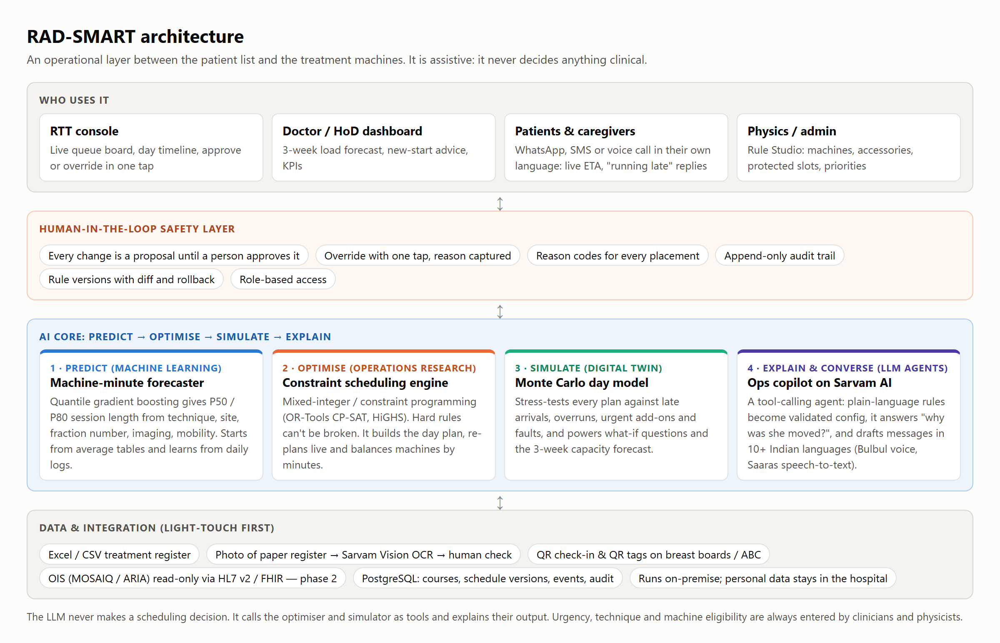
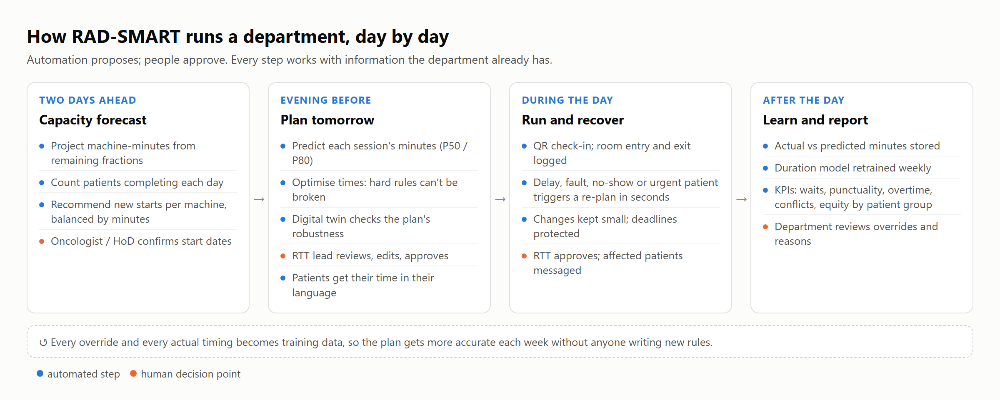
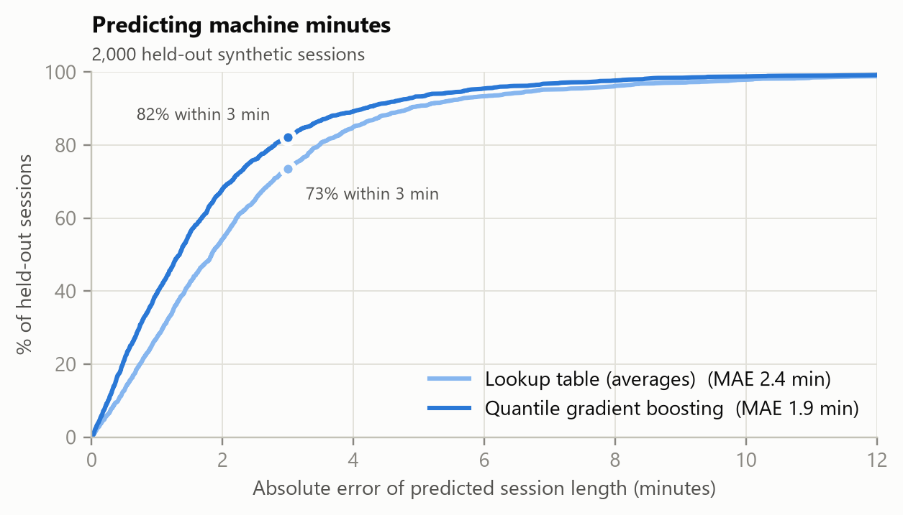
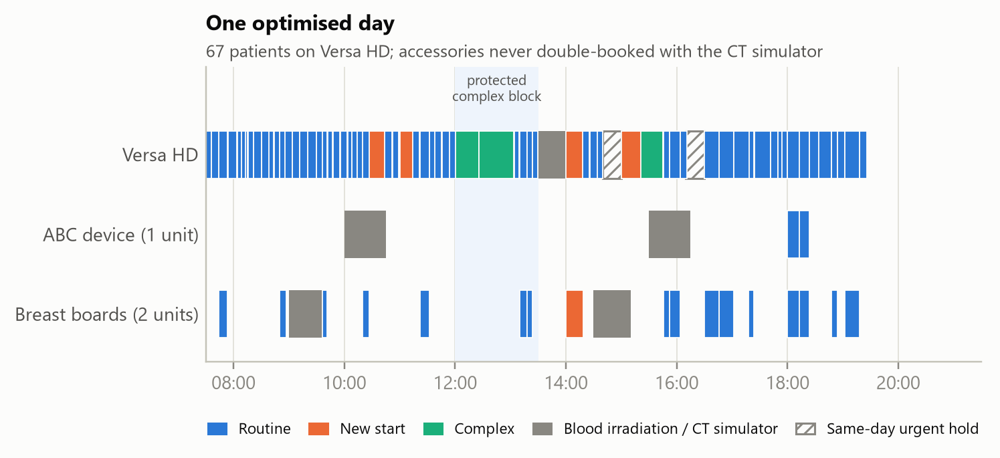
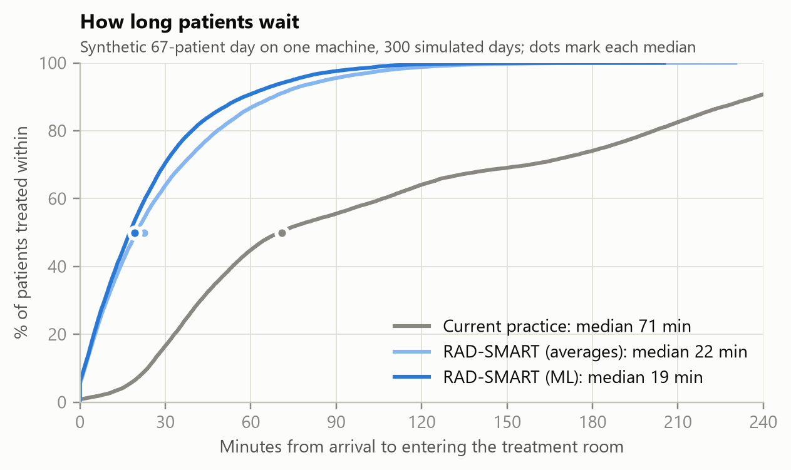
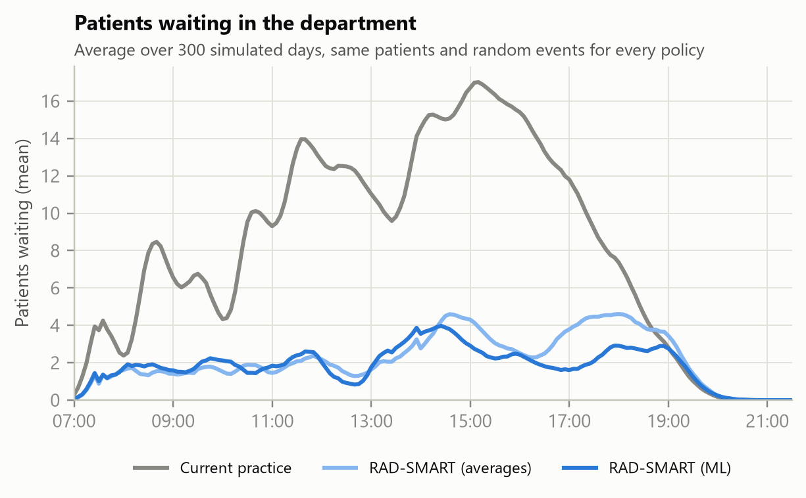
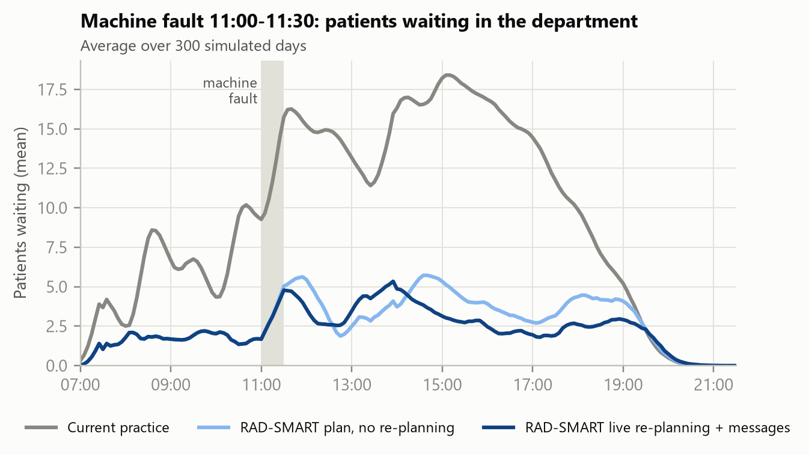
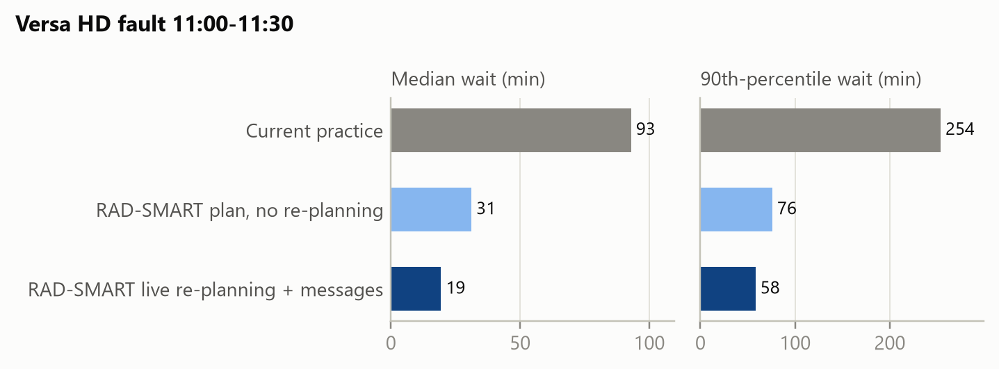
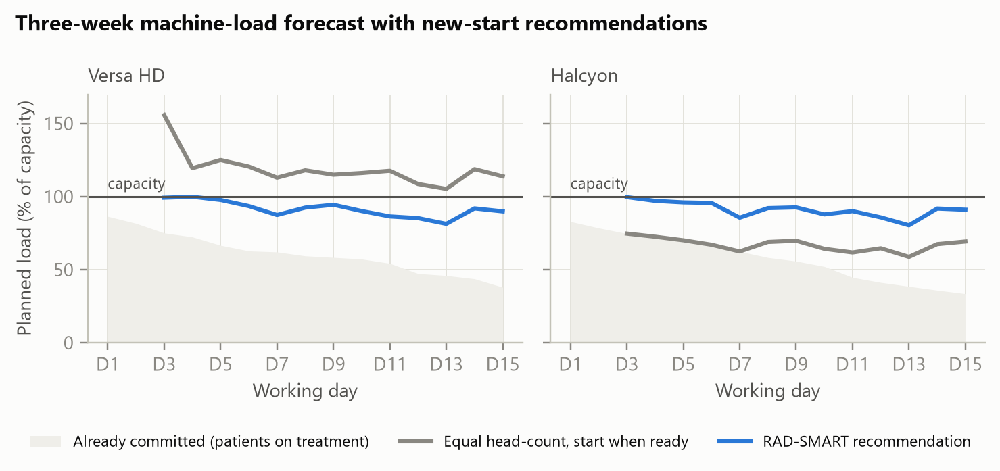

# RAD-SMART: Research Report and Implementation Plan

**Radiotherapy AI-assisted Dynamic Scheduling, Machine Allocation and Resource Tracking**

Health-a-thon 2026 · Cancer track · Doctor / care-team facing use case 04: Clinic Operations & Patient Flow

Problem owner and doctor partner: Dr Akshay Dinesan, Manipal · Technology team: [names to be added] · Version 1.0, September 2026

> **Assistive, not diagnostic.** RAD-SMART plans *when* and *on which machine* a session takes place. It never decides whether, how or how much a patient is treated. Urgency, technique and machine eligibility are always entered by clinicians and physicists, every plan is a proposal until a person approves it, and every action is logged. All data in this report are synthetic.

---

## 1. Executive summary

**The problem.** A radiotherapy machine treats 70–90 patients a day, most of them every working day for weeks. Today, radiation therapy technologists (RTTs) give out appointment times by hand, without a measure of how many machine-minutes each patient actually needs. Too many patients are told to come at the same time, so they wait, sometimes for hours, every day of a 5–7 week course. The department also has to fit in new starts before 5 PM, complex procedures while senior staff are present, a fixed blood-irradiation slot, accessories shared with the CT simulator, same-day urgent patients, machine faults, and soon a second machine with different capabilities. As the problem statement says, this is not appointment booking. It is dynamic allocation of machine time, staff and shared resources under many constraints.

**Our answer.** RAD-SMART is an operational layer between the patient list and the machines, built as a hybrid AI system with four parts:

1. **Predict.** A machine-learning model predicts each session's machine-minutes as a typical value (P50) and a cautious value (P80). It starts from the department's average tables and learns from every day's timestamps.
2. **Optimise.** A constraint-optimisation engine turns those minutes into a minute-level plan for each machine. Hard rules (new starts before 5 PM, complex cases in the senior-staff window, the blood slot, accessory limits) cannot be broken, because the solver will not produce a plan that breaks them.
3. **Simulate.** A digital twin of the department stress-tests every plan against late arrivals, overruns, urgent add-ons and machine faults. The same engine gives a three-week machine-load forecast and a two-day-ahead advice on how many new patients to start on each machine.
4. **Explain and converse.** A copilot on Sarvam AI's Indian-language models explains every placement in plain language and turns rule changes typed in plain language into versioned, validated configuration. It also sends patients and caregivers their time, and live updates, by WhatsApp, SMS or voice call in their own language. The copilot never makes a scheduling decision.

**The evidence so far.** We built a working proof of concept (PoC) in Python and tested it on synthetic data: a 67-patient, 90%-loaded day on a Versa HD, simulated 300 times with realistic randomness.

| What we measured (synthetic, 300 simulated days) | Current practice (modelled) | RAD-SMART |
|---|---|---|
| Median wait, arrival to entering the treatment room | 71 min | **19 min (−73%)** |
| 90th-percentile wait | 227 min | **52 min (−77%)** |
| Patients treated within ±15 min of their time | 16% | **62%** |
| Average time spent in the department | 117 min | **34 min** |
| New starts after 5 PM, complex cases deferred, accessory clashes | occasional | **none** |
| 30-minute machine fault at 11:00: median wait | 93 min | **19 min** with live re-planning (4 s) |
| Two-machine new-start planning: peak planned load | 156% on one machine | **100% on both** |

Two findings matter most for a real rollout. First, the optimiser using only average durations already cuts the median wait from 71 to 22 minutes, so the department benefits from day one, before any machine learning has been trained. Machine learning then adds punctuality (54.8% → 62.4% of patients within ±15 minutes). Second, hard rules held in every simulated day.

**The pilot.** 90 days on the Versa HD: two weeks measuring the baseline, three weeks in shadow mode, then eight weeks live. The primary KPI is median waiting time from arrival to linac entry, with a target reduction of at least 40%. It needs about ₹2–3 lakh of hardware and messaging costs and works with the Excel lists, paper registers and WhatsApp the department already uses.

**Why this can win.** It solves a daily, high-frequency pain for thousands of patients and their caregivers. It uses AI where each technique is strongest: machine learning to predict, mathematical optimisation to guarantee, simulation to test, and a language model to explain and talk to people. It stays inside the hackathon's guardrails by design, and it already produces measured results rather than a mock-up.

<!-- pagebreak -->

## 2. The problem and why it matters

### 2.1 What happens today

Radiotherapy differs from a normal outpatient clinic. A patient attends every working day for 1–2 weeks (palliative) or 5–7 weeks (curative), so one machine carries 70–90 patients a day. It has to absorb new starts, urgent palliative patients who must start the same day as their consultation, and complex procedures such as SBRT, SRT, TBI and CSI. A routine session occupies roughly 7–15 minutes of machine time, while a new start or complex procedure takes 20–60 minutes.

Appointment times are given by hand. They are not based on how long each treatment takes or how loaded the machine is. As a result, too many patients are asked to report in the same period and other periods sit under-used. Patients have an appointment yet still face long, unpredictable waits.

### 2.2 Constraints the plan must respect

The problem statement lists these rules. We classify each as hard (never broken) or soft (traded off), and every one of them is editable configuration, not code.

| Rule | Type | How RAD-SMART treats it |
|---|---|---|
| Complex treatments (SBRT, SRT, TBI, CSI) need senior staff, 10 AM – 5 PM | Hard | Session must start and end inside the window, with a safety buffer |
| Protected slot for complex procedures, 12:00 – 1:30 PM | Soft (configurable to hard) | Complex cases are pulled into it; routine patients are discouraged from it |
| New starts completed before 5 PM | Hard | Planned to finish at least 25 min before the cut-off (buffer configurable) |
| Blood irradiation slot, 1:30 – 2 PM | Hard | Machine blocked |
| Shared accessories (breast boards, ABC) also booked by the CT simulator | Hard | Counted per unit, including CT-simulator bookings and transfer time |
| Urgent / palliative same-day starts | Hard (capacity held) | Holds reserved in the afternoon; released if unused |
| Priority groups: paying, elderly, inpatient, MHRC / hospice, dormitory, public transport | Soft, with hard limits where logistics demand | Weighted preferences; the latest-return time for transport-dependent patients is hard |
| Machine capability (Versa HD vs Halcyon) | Hard | Eligibility matrix maintained by physics |
| Machine downtime and delays | Event | Triggers minimum-disruption re-planning |
| Staff overtime | Soft | Penalised in the objective |

### 2.3 Evidence from India and elsewhere

- **Waiting is a daily, measurable burden.** An audit of 34,438 sessions at an advanced Indian centre with two linacs and barcode check-in found a mean gross wait (arrival to linac entry) of 37.4 minutes and a mean total time in the department of 52.4 minutes on routine days. Mean set-up plus treatment time was only 15.1 minutes [3]. Centres without digital queueing report much longer waits. At Tata Memorial Centre, a quality-improvement project cut the median first-day wait from 6 to 4.5 hours [5].
- **Communication is the best-rated fix.** A survey of Indian radiation oncology departments identified two-way communication with patients as the most effective waiting-time strategy [4].
- **Capacity is scarce, so every minute counts.** India has about 823 radiotherapy machines, roughly 0.6 per million people, with a shortfall estimated at 1,209 machines. 69% of the 554 facilities have only one machine [6], which means one bad day on that machine affects every patient in the centre.
- **Repetition multiplies the harm.** A patient waiting an extra hour a day on a 25-fraction course loses about 25 hours, and so does the caregiver who usually comes with them.

### 2.4 What changes if we solve it

For patients, the plan means predictability: they arrive close to their real treatment time and hear about delays before they leave home. RTTs no longer have to juggle times by hand or reshuffle the queue after every disruption. Clinicians get complex procedures reliably placed while supervision is available. The department gets smoother machine use, less overtime, objective new-start planning and data for future capacity decisions.

## 3. Fit with Health-a-thon 2026

| Hackathon expectation | How RAD-SMART meets it |
|---|---|
| Non-clinical, operational workflow problem | Scheduling, queueing and resource tracking. It uses operational tags only: technique, fraction number, accessories, logistics flags |
| Out of scope: diagnosis, treatment recommendations, clinical decision support, risk scoring, interpretation of medical data | It does not read images, doses, diagnoses or notes, and it does not decide urgency or eligibility. Clinicians and physicists enter those |
| Human override on every automated step | Every plan and re-plan is a proposal; the RTT lead approves or edits it in one tap and the reason is captured |
| Audit trail | Append-only log of plans, edits, overrides, rule versions, messages and model versions |
| Measurable KPI with baseline | Median wait from arrival to linac entry, with a 2-week baseline; secondary and balancing KPIs in Section 8 |
| Pilot evidence in 60–90 days | 90-day plan: baseline, shadow mode, then live, analysed as an interrupted time series |
| Light integration; works with paper, Excel, WhatsApp | Imports the Excel list or a photo of the paper register. QR check-in. OIS integration only in phase 2, read-only |
| Multilingual and caregiver-friendly | Messages in the patient's language by WhatsApp, SMS or voice, with an optional caregiver copy. Spoken "running late" replies are understood |
| Leverage existing AI capabilities and frameworks | Sarvam AI (LLM, speech, translation, OCR), LangGraph from the LangChain ecosystem for tool orchestration, OR-Tools, scikit-learn |
| Easy for busy clinics | Evening-before plan in one screen; live board; one-tap approve; printable fallback list |

---

## 4. State of the art and the gap

**Operations research in radiotherapy is proven, but mostly for choosing the day.** A literature review of radiotherapy resource planning shows decades of work on patient scheduling [7]. Dynamic programming and Markov models allocate treatment start days to incoming patients [11]. Prediction-based online policies decide how long each new patient should wait for a start date [12], and column-generation methods handle machine unavailability [22]. In practice, a MILP scheduler implemented at two Dutch centres produced weekly schedules in 5 minutes instead of 1.5 days of manual work and cut the variation in daily appointment times by 51% [8]. Time-window preferences can be honoured for almost all sessions [9]. At a ten-linac Belgian centre, automated scheduling reduced the average wait to start treatment by 80% [10]. These systems mostly optimise *which day*, in large multi-machine, fully digital European centres.

**Duration prediction works.** Models trained on positioning and treatment times predict session length well enough to schedule by the minute [13], and earlier regression-tree models reached 84% accuracy for treatment duration [14].

**New AI methods are being tried, with trade-offs.** Deep reinforcement learning has been applied to integrated pre-treatment and treatment scheduling [15]. A 2026 preprint tests large language models directly as radiotherapy schedulers under realistic constraints [16]. Neither gives the verifiable guarantee a department needs for rules such as "no new start after 5 PM".

**The gap RAD-SMART fills.**

1. **Within-day, minute-level sequencing.** Sessions are placed by predicted minutes, with shared accessories and CT-simulator bookings in the same model.
2. **Live recovery.** When the machine is down or a patient is late, the rest of the day is re-planned in seconds while keeping changes small, and the right patients are told in time.
3. **The Indian setting.** It is built for one- or two-machine centres, mixed Elekta and Varian fleets, patients who depend on public transport, low digital literacy, many languages, and paper or Excel workflows.
4. **Safe use of language models.** The LLM is the interface for explanations, rule editing and multilingual messages. It is not the decision-maker, so hard rules are guaranteed by the solver while people still talk to the system in plain language.

As far as we could find, no published or commercial system combines prediction, guaranteed-constraint optimisation, simulation, plain-language explanation and multilingual patient messaging in a light-integration package for this setting.

## 5. Five approaches considered

We considered five ways to build RAD-SMART and scored them against the hackathon's priorities.

**A. Rule-based slot templates.** Fixed slot lengths by technique (for example 10 minutes routine, 30 minutes new start), filled first-come-first-served, with block rules. It is simple, transparent and quick to build. But it cannot absorb variation, balance machines by minutes, or recover from disruption, and staff end up overriding it constantly.

**B. LLM-only agent.** A large language model receives the patient list and the rules in a prompt and writes the schedule. It is flexible, conversational and quick to demo. However, it cannot guarantee hard constraints, is weak at arithmetic packing, gives different answers to the same input, and is hard to audit. That is unacceptable when a missed rule means an unsupervised complex treatment.

**C. Classical optimisation, static.** A mixed-integer model builds the day plan from average durations each evening. It is proven in the literature and guarantees hard rules. On its own, though, it has no learning, no live recovery, no forecasting, and no way to talk to patients or staff.

**D. Deep reinforcement learning.** A policy is trained in simulation to decide appointment times. It is adaptive in principle, but it needs large volumes of data and simulation, acts as a black box, offers no guarantee on hard rules, and is hard to reconfigure for another department.

**E. Hybrid: predict, optimise, simulate, explain (selected).** Machine learning predicts minutes. Constraint optimisation builds and repairs the plan with guaranteed rules. A digital twin tests plans and forecasts load. An LLM copilot explains the plan, edits rules and speaks the patient's language. Each technique does what it is best at, and each can be switched off without breaking the others.

| Criterion (weight) | A. Rule templates | B. LLM-only | C. Static optimisation | D. Deep RL | E. Hybrid |
|---|---|---|---|---|---|
| Safety and scope compliance (20%) | 5 | 1 | 5 | 2 | 5 |
| Impact on waits and utilisation (20%) | 2 | 2 | 4 | 4 | 5 |
| Real-time adaptivity (15%) | 1 | 3 | 2 | 4 | 5 |
| Feasibility in the sprint and a 90-day pilot (15%) | 5 | 3 | 4 | 1 | 4 |
| Explainability and audit (10%) | 4 | 2 | 4 | 1 | 5 |
| Ease of use and multilingual reach (10%) | 2 | 5 | 2 | 2 | 5 |
| Configurability for other departments (10%) | 2 | 4 | 3 | 2 | 5 |
| **Weighted score (out of 5)** | **3.10** | **2.60** | **3.60** | **2.45** | **4.85** |

Scores run from 1 (poor) to 5 (excellent). The hybrid scores lower only on feasibility, because it has more parts. We handle that by building it in layers. The optimiser with average tables works on its own from week 1, and machine learning, simulation and the copilot are added on top.

<!-- pagebreak -->

## 6. The recommended solution

### 6.1 Architecture

{width=6.7}

### 6.2 How a day runs

{width=6.7}

1. **Two working days ahead.** The capacity forecast projects each machine's committed minutes from every patient's remaining fractions, counts completions, and recommends how many new patients to start on each machine. The oncologist or head of department confirms who starts and when.
2. **Evening before.** The duration model predicts each session's minutes. The optimiser builds the plan, and the digital twin checks how robust it is. The RTT lead reviews, edits and approves it. Patients receive their time in their own language.
3. **During the day.** QR check-in and room entry and exit are logged. A delay, fault, no-show, urgent add-on or a patient's "running late" reply triggers a re-plan proposal within seconds. When the RTT approves it, affected patients who can still act on it are messaged.
4. **After the day.** Actual and predicted minutes are stored. The model is retrained weekly, and a new version goes live only after human approval. The KPI dashboard updates, and the department reviews overrides and their reasons.

### 6.3 Module 1: Predict machine-minutes

- **Inputs** are operational tags already on the treatment card: technique (palliative, 3D-CRT, IMRT, VMAT, breast, breast with DIBH/ABC, SBRT, SRT, CSI, TBI), site group, fraction number (first fraction or not), imaging (none, kV or CBCT), mobility (walking, wheelchair or stretcher), accessories and machine.
- **Model.** A gradient-boosted regressor with quantile loss gives P50 (typical) and P80 (cautious) minutes. By default the plan uses P50 and can use P80 for long or variable sessions such as new starts and complex cases. The P80 is also used to warn when a plan is fragile.
- **Cold start.** Until enough history exists, the department's own average table is used. The PoC shows that the optimiser plus averages already captures most of the benefit (Section 7).
- **Learning loop.** Every session's actual time is logged by QR or tablet taps, or from OIS timestamps where available. The model is retrained weekly with a drift report, and a new version goes live only after human approval.

### 6.4 Module 2: Optimise the day

**Formulation.** The day is a grid of 2-minute steps. Each session is placed on an eligible machine at a start time. The model is a mixed-integer program, and the production version will use constraint programming with interval variables.

```
Decide   start time and machine for each session (or "unscheduled", heavily penalised)
Subject to (hard):
  - one session at a time per machine; machine blocks (blood irradiation, QA, faults)
  - machine eligibility from the physics capability matrix
  - complex sessions inside the senior-staff window (10:00-17:00, minus buffer),
    at most N complex sessions at once
  - new starts finish by 17:00 minus a 25-min buffer
  - accessory units: sessions using an accessory + CT-simulator bookings <= units,
    including transfer time between rooms
  - patient hard windows: inpatient ward window, hospice vehicle window,
    last bus / train minus buffer
  - capacity holds for same-day urgent starts
Minimise (soft):
    w1 x minutes away from requested / usual time (beyond a tolerance)
  + w2 x elderly after 1 PM  + w3 x transport-dependent after noon
  + w4 x complex outside the 12:00-13:30 protected block + w5 x routine inside it
  + w6 x overtime minutes    + w7 x movement from already-published times (live mode)
  + 1000 x unscheduled sessions (x5 for new starts and complex)
```

All weights, windows and buffers are configuration that the department can see and change.

**Solving a 70–90-patient day in seconds.** A single large model over a whole day is slow. RAD-SMART solves it coarse-to-fine in two stages.

1. Stage 1 levels the load in 15-minute buckets. Complex cases and new starts, the "big rocks", are placed as whole units, and routine patients are spread continuously.
2. Stage 2a places the big rocks exactly, near their stage-1 bucket, and locks them.
3. Stage 2b places everyone else on the 2-minute grid, within ±50 minutes of their bucket.
4. If a patient cannot be placed, that patient's window is opened fully and the other windows are doubled, and the solver tries again.

On the PoC day this reaches a proven optimum in 2–8 seconds on a laptop with the open-source HiGHS solver (up to 24 seconds when the laptop was busy).

**Reason codes.** Every placement comes with machine-readable reasons, such as "new start: finish by 17:00", "public transport: finish by 17:45", "34 min later than usual time 08:30", or "accessory check: breast board free (CT-sim bookings avoided)". These drive the RTT console and ground the copilot's explanations.

### 6.5 Module 3: Live re-planning

When an event arrives (machine fault, overrun, no-show, urgent add-on, or a patient replying "running late"), RAD-SMART does the following:

- It freezes what has already started, and re-solves the rest of the day with an extra cost for moving any patient away from the time they were already given.
- It never asks a patient to come *earlier* than they were told unless they can be reached in time. Patients who cannot be reached keep their published time as their earliest start.
- It messages only patients whose appointment is at least 45 minutes away and whose time moves by at least 5 minutes, so it does not flood patients or staff.
- It keeps every hard rule. For example, a new start pushed by a fault still finishes before 5 PM.
- It presents the change to the RTT as a proposal, showing the patients affected and the minutes moved, and waits for approval.

### 6.6 Module 4: Capacity forecast and new-start advisor

For each machine and each of the next 15 working days, RAD-SMART does the following:

1. It computes the committed load: the predicted minutes of every patient still on treatment, from their remaining fractions.
2. It counts the patients completing each day.
3. It takes the pipeline of patients whose plans will be ready and assigns start days from two working days ahead, each patient to the eligible machine with the most free minutes. It keeps every day of their course within a target utilisation (92%) after reserving capacity for urgent starts.

The output reads like the example in the problem statement, for instance "Wednesday: several patients completing, recommend 7 new starts on Versa HD, 9 on Halcyon". Clinicians decide *which* patients start. RAD-SMART advises *how many* and *where*, balanced by minutes rather than head-count.

### 6.7 Module 5: Shared resource tracking

Accessories such as breast boards, the ABC device and immobilisation devices are modelled as limited resources shared with the CT simulator. The CT-simulator's own bookings are entered by the simulator staff or imported from its list. Each accessory carries a QR tag scanned when it leaves or arrives in a room, so the system knows where it is. Conflicts are prevented in the plan, and anything that happens live (an accessory not returned, for example) raises an alert before the patient is called.

### 6.8 Module 6: Copilot and multilingual communication (Sarvam AI)

**For staff (RTT console and Rule Studio):**
- *"Why was patient P034 moved to 11:25?"* The copilot answers from the placement's reason codes and the re-plan log, and never from guesswork.
- *"From next Monday the blood irradiation slot is 2:00–2:30 on Fridays."* The copilot converts the sentence into a structured rule, validates it against the schema, shows a before/after diff and a digital-twin impact estimate, and saves it as a new rule version only after an authorised person approves. Earlier versions can be restored with one tap.
- *"What happens if we start 3 extra patients on Wednesday?"* The copilot calls the forecast and simulation tools and summarises the result.

**For patients and caregivers:**
- **Evening-before message** with the next day's time, in the patient's chosen language and channel: WhatsApp, SMS, or an automated voice call for patients who do not read messages.
- **Live updates** when the day moves: "The machine is running about 30 minutes late. Your new time is 11:25. You do not need to come earlier."
- **Voice replies.** A patient can say "the bus is late, I will be 20 minutes late" in their own language. Speech-to-text and intent detection turn it into an event on the RTT console.
- **Caregiver copy.** With the patient's consent, the same message goes to a family member.
- **No clinical content.** Messages carry times and logistics only. Any health question gets the reply "please speak to your doctor or nurse".

**Sarvam AI components** [17]:

| Need | Sarvam component |
|---|---|
| Copilot reasoning and tool calling | Sarvam-105B (128K context; 10 Indian languages + English) |
| Voice calls to patients | Bulbul v3 text-to-speech (11 languages) |
| Understanding spoken replies | Saaras v3 speech-to-text (23 languages, code-mixed speech) |
| Message translation | Sarvam Translate / Mayura |
| Paper register import | Sarvam Vision (document OCR, 23 languages) |

**Guardrails for the language model:**
- The LLM runs through an allow-list of tools orchestrated with LangGraph. It can read plans and propose rule changes, but it cannot write a schedule or send a message on its own.
- It sees pseudonymous IDs and operational tags only. Names and phone numbers are added on the hospital's server when a message is sent, so personal identifiers never reach the model.
- Patient messages come from fixed templates. Each template's translation is produced once, checked by a native-speaking staff member and approved, which WhatsApp requires anyway. The model only fills in times.
- If the model or the internet is unavailable, the console shows the raw reason codes and the templates still work, so the scheduling itself never depends on the LLM.

### 6.9 Safety, override and audit

- Every automated output is a proposal, including plans, re-plans, new-start advice, rule changes and new model versions.
- An override takes one tap and asks for a reason (a pick-list plus optional free text). Overrides feed weekly review and model learning.
- An independent checker, separate from the solver, re-verifies every hard rule before a plan can be published.
- The append-only audit log records who did what and when, which rule and model versions were used, and every message sent.
- A manual fallback is always available: a printed list, and a one-click switch back to manual mode.

<!-- pagebreak -->

## 7. Proof-of-concept evidence

### 7.1 What we built and how we tested it

The PoC (folder `poc/`) implements Modules 1, 2, 3 and 4 in about 1,700 lines of Python. It uses scikit-learn for the quantile model, SciPy's interface to the open-source HiGHS solver for the MILP, and NumPy for the simulator. All patients are synthetic.

- **Synthetic department.** The operating day runs 07:30–20:30 with overtime allowed to 21:30. It includes the blood-irradiation slot 13:30–14:00, the senior-staff window 10:00–17:00, the protected block 12:00–13:30, a 17:00 new-start cut-off with a 25-minute buffer, two urgent holds, one ABC unit and two breast boards, and CT-simulator accessory bookings.
- **Test day.** 67 patients on the Versa HD (5 new starts, 3 complex, 18 dependent on public transport, 18 paying, 7 elderly, 7 inpatients, 17 using a breast board, 2 using ABC). They need 676 of 750 available minutes, a load of 90.1%.
- **Current practice (modelled).** Patients are given hourly block times, weighted towards the morning, and treated first-come-first-served, as is typical for manual allocation. This baseline is our assumption. The pilot's two-week baseline will replace it with measured data.
- **Randomness.** Each simulated day draws real session times from a lognormal spread around each technique's true median. Patients arrive on average 10 minutes early (standard deviation 12). 2% do not attend, 85% follow an updated time when told, and there are on average 1.2 urgent same-day starts. The same random draws are used for every policy (common random numbers), so the comparisons are fair.
- **KPI definitions** follow Munshi et al. [3]: gross wait (WTG) runs from arrival to linac entry, and net wait (WTN) from appointment to linac entry.

### 7.2 Predicting machine-minutes

{width=5.6}

| Model | Mean absolute error | Within 2 min | Within 3 min | P80 coverage (target 80%) |
|---|---|---|---|---|
| Lookup table of averages | 2.43 min | 54.3% | 73.5% | 80.1% |
| Quantile gradient boosting | **1.92 min** | **67.9%** | **82.3%** | 78.2% |

Trained on 12,000 synthetic historical sessions, the model learns effects the average table misses, such as first-fraction extra time, CBCT versus kV imaging, wheelchair and stretcher transfers, and Halcyon's faster delivery.

### 7.3 The optimised day

{width=6.7}

Both planning modes, average tables and machine learning, reached a **proven optimal** plan with **zero unscheduled patients**. Averages took 2.1 seconds and machine learning 8.2 seconds (timings vary with the laptop's load; our slowest run took 24 seconds), for a model of about 6,000 variables and 1,327 constraints on a laptop. A sample of the plan, with reason codes, is in Appendix C.

### 7.4 Waiting times over 300 simulated days

{width=5.8}

{width=5.8}

| Metric (mean of 300 simulated days) | Current practice | RAD-SMART, averages | RAD-SMART, ML |
|---|---|---|---|
| Median wait, arrival to room (min) | 70.8 | 22.5 | **19.2** |
| 95% range of daily median wait (min) | 50.1–106.3 | | 6.5–38.1 |
| 90th-percentile wait (min) | 226.5 | 60.5 | **52.0** |
| Median delay versus appointment (min) | 66.0 | 13.8 | **10.0** |
| Treated within ±15 min of appointment | 15.5% | 54.8% | **62.4%** |
| Treated within ±30 min of appointment | 27.7% | 74.6% | **81.9%** |
| Mean time in department (min) | 117.1 | 38.7 | **34.4** |
| Overtime (min per day) | 0.2 | 0.3 | 0.4 |
| New starts finishing after 5 PM (per day) | 0.1 | 0 | 0 |
| Complex cases deferred (per day) | 0.1 | 0.1 | 0 |
| Accessory-related delays (per day) | 0.1 | 0 | 0 |
| Delay to blood-irradiation slot (min) | 2.3 | 1.0 | 2.2 |
| Urgent patients treated the same day | 100% | 100% | 100% |

The same patients get the same machine time with no added overtime, yet waits fall by about three-quarters, because patients are told to come when the machine will actually be free. The waiting room holds about 2–4 people instead of up to 17.

### 7.5 Recovering from a machine fault

We injected a 30-minute Versa HD fault at 11:00 into every simulated day and compared three responses. In the first, no plan is changed. In the second, the RAD-SMART plan is kept but nobody is told. In the third, RAD-SMART re-plans live and messages the patients who can still act on the change.

{width=5.8}

{width=5.8}

| Metric | Current practice | RAD-SMART plan, no re-planning | RAD-SMART live re-planning + messages |
|---|---|---|---|
| Median wait (min) | 93.0 | 31.2 | **19.4** |
| 90th-percentile wait (min) | 253.7 | 76.0 | **58.2** |
| Treated within ±15 min | 14.3% | 46.2% | **60.9%** |
| Mean time in department (min) | 133.4 | 46.5 | **40.6** |
| Overtime (min per day) | 0.6 | 0.8 | 2.4 |
| New starts after 5 PM / complex deferred (per day) | 0.2 / 0.2 | 0.1 / 0.2 | **0 / 0** |

The re-plan took **4.0 seconds** (12 seconds in our slowest run). It moved 38 patients and messaged 17 (those whose time changed by at least 5 minutes and who had at least 45 minutes' notice). The trade-off is visible and honest: about 2 minutes more overtime per day, in exchange for keeping every new start before 5 PM and every complex case in its window.

### 7.6 Two-machine new-start planning

We tested the forecast on a synthetic two-machine department: 72 patients on treatment on the Versa HD, 105 on the Halcyon, and 84 patients in the planning pipeline over three weeks. RAD-SMART was compared with the common practice of splitting new patients equally by head-count and starting each as soon as they are ready.

{width=6.7}

| Result | Equal head-count, start when ready | RAD-SMART recommendation |
|---|---|---|
| Peak planned load, Versa HD | 156% | **100%** |
| Peak planned load, Halcyon | 75% | **100%** |
| Decision days over capacity, Versa HD | 13 of 13 | **0** |
| Pipeline patients still waiting at the end of the horizon | n/a | **0** |

Splitting by head-count overloads the slower Versa HD on every decision day while the Halcyon sits under-used, which is the "forty simple versus thirty complex" point made in the problem statement. Balancing by predicted minutes fills both machines to their target and starts everyone within the horizon. The advisor's first ten days:

| Day | Versa HD load | Finishing | New starts | Halcyon load | Finishing | New starts |
|---|---|---|---|---|---|---|
| Mon 1 | 86% | 4 | – | 83% | 5 | – |
| Tue 2 | 82% | 4 | – | 79% | 5 | – |
| Wed 3 | 75% | 3 | **7** | 75% | 3 | **9** |
| Thu 4 | 72% | 2 | 4 | 73% | 3 | 4 |
| Fri 5 | 67% | 4 | 3 | 70% | 4 | 3 |
| Mon 6 | 63% | 1 | 1 | 67% | 5 | 3 |
| Tue 7 | 62% | 2 | 1 | 62% | 5 | 0 |
| Wed 8 | 59% | 1 | 3 | 58% | 3 | 4 |
| Thu 9 | 58% | 1 | 3 | 56% | 4 | 4 |
| Fri 10 | 57% | 3 | 2 | 52% | 7 | 3 |

"Load" is the share of capacity already committed by patients on treatment; "new starts" is the recommendation that fills the gap up to the target. Days 1 and 2 are already booked, because decisions are made two working days ahead.

### 7.7 Limitations of the PoC

- All data are synthetic. The "current practice" baseline is a model of manual block booking, not a measurement at Manipal. The size of the real improvement depends on how much of today's waiting comes from scheduling rather than from other causes such as transport, machine QA or paperwork, which the pilot's baseline will reveal.
- The simulation assumes 85% of patients act on updated times and that arrivals are about 10 minutes early. Both will be measured in the pilot.
- The day simulation covers one machine. The two-machine test covers the forecast, not simultaneous live sequencing, which is part of the build sprint.
- Solver times were measured on a laptop with an open-source MILP solver. Production will use OR-Tools CP-SAT, which is well suited to interval scheduling.

For these reasons the pilot target (at least 40% lower median wait) is set well below the PoC result (73% lower).

<!-- pagebreak -->

## 8. KPIs and expected impact

### 8.1 Measurement framework

| Type | KPI | Definition and source | Pilot target |
|---|---|---|---|
| **Primary** | Median gross waiting time (WTG) | Linac room entry minus arrival (QR check-in and tablet tap), all sessions, per day | ≥ 40% lower than baseline by day 90 |
| Secondary | 90th-percentile WTG | As above | ≥ 40% lower |
| Secondary | Punctuality | % of sessions starting within ±15 and ±30 min of the appointment | ±15 min: from baseline to ≥ 50% |
| Secondary | New starts on time | % of new starts finished before 17:00 | 100% |
| Secondary | Complex cases in window | % of complex sessions inside the senior-staff window | 100% |
| Secondary | Daily overtime | Minutes after regular end | Not above baseline |
| Secondary | Scheduling conflicts and accessory delays | Count per week | ≥ 80% fewer |
| Secondary | Prediction accuracy | Mean absolute error; % within 3 min | MAE ≤ 2.5 min |
| Secondary | Occupancy forecast error | Predicted versus actual daily machine-minutes | ≤ 10% |
| Secondary | RTT scheduling effort | Self-reported minutes per day spent on appointments | ≥ 50% lower |
| Balancing | Throughput | Patients treated per day | Not lower than baseline |
| Balancing | Equity | Median wait by group: elderly, transport-dependent, language, paying versus non-paying | No group worse off |
| Balancing | Human control | Override rate and reasons; plans approved without edits | Tracked; reviewed weekly |
| Balancing | Patient experience | Short survey in the patient's language (predictability, stress) | Improvement over baseline |

### 8.2 Impact estimate (illustrative, conservative)

- **Per patient.** If the in-department wait falls by even 30 minutes a day (the PoC suggests about 50), a 25-fraction course saves about 12.5 hours, and roughly as much again for the caregiver who comes along.
- **Per machine per year.** 30 minutes × 80 patients × 250 working days = **10,000 patient-hours**, about 20,000 person-hours including caregivers.
- **Capacity.** Balanced loading, fewer idle gaps and faster backfilling of no-shows free up machine time. As an illustration only, not a PoC result: if smarter scheduling recovered 5% of machine time across India's ~823 machines [6], that would equal about 41 machines, or roughly ₹800–1,000 crore of equipment at recent public-sector prices (two linacs at AIIMS Jhajjar cost about ₹50 crore [21]).
- **Scale.** The rules are configuration, not code, so another department can adopt RAD-SMART by describing its own rules in the Rule Studio. The National Cancer Grid's 370+ member institutions, which serve about 60% of India's cancer patients, are the natural path to scale.

<!-- pagebreak -->

## 9. Implementation plan

### 9.1 Timeline

| Phase | Dates | Outcome |
|---|---|---|
| Round 1 submission | by 25 Sep 2026, 23:59 | Idea, deck, PoC evidence, this report |
| Evaluation and shortlisting | 26 Sep – 3 Oct 2026 | |
| Build sprint (5 weeks) | 5 Oct – 8 Nov 2026 | Working prototype on synthetic data, validated with the RTT team |
| Top 30 announced | by 14 Nov 2026 | |
| Grand finale, IIT Bombay | 28 Nov 2026 | Live demonstration |
| Approvals | Nov 2026 – Jan 2027 | HoD, ethics/QI, IT, messaging registrations |
| 90-day pilot | from approval (target Q1 2027) | KPI evidence |
| Scale-up | after pilot | Halcyon, OIS integration, other NCG centres |

### 9.2 Build sprint plan (5 Oct – 8 Nov)

| Week | Build | Doctor partner's role |
|---|---|---|
| W1 (5–11 Oct) | Data model and Excel import; rule configuration (YAML) with versioning; port the optimiser to OR-Tools CP-SAT; synthetic data generator calibrated with the department's averages | Confirm rules, windows, techniques and average times; answer the open questions (Appendix B) |
| W2 (12–18 Oct) | RTT console: day timeline, live queue board, approve / edit / lock, override with reason, audit log; live re-planning; accessory tracking with QR tags | Walk-through with RTTs; check that the screens fit the real workflow |
| W3 (19–25 Oct) | Sarvam integration: copilot ("why" answers, Rule Studio), WhatsApp / SMS / voice templates in 3–5 languages, spoken "running late" replies, OCR import of a paper register | Review message wording; arrange native-speaker checks of translations |
| W4 (26 Oct – 1 Nov) | Two-machine allocation; capacity forecast and new-start advisor; KPI and equity dashboard; digital-twin what-if screen | Validate forecast logic against real experience; agree KPI definitions |
| W5 (2–8 Nov) | Hardening, independent rule checker, test suite, usability test with RTTs on synthetic data, demo video, final submission | Final clinical-fit review; co-present |

### 9.3 Finale demonstration (28 Nov)

1. Load a synthetic 80-patient day from an Excel list and a photo of a paper register.
2. Generate and approve the plan, and show that hard rules hold and every placement has a reason.
3. A patient's phone receives the time in Kannada, and a voice call plays in Malayalam.
4. Inject a machine fault. The re-plan proposal arrives in seconds, the RTT approves it, and messages go out.
5. A patient says "I'm stuck in traffic" by voice, and the queue adjusts.
6. Ask the copilot "why was this patient moved?" and change a rule in plain language, with diff, approval and re-plan.
7. Show the two-day-ahead new-start advice for two machines and the KPI dashboard.

### 9.4 90-day pilot design

| Days | Phase | What happens |
|---|---|---|
| 1–14 | Baseline | QR check-in and room timestamps start, with no change to scheduling. This measures the true baseline and collects duration data |
| 15–35 | Shadow mode | RAD-SMART plans every evening. RTTs keep scheduling as usual and compare. Prediction accuracy and plan acceptability are measured |
| 36–90 | Live on the Versa HD | RTT lead approves the plan each evening. Patients receive times and live updates. Re-planning is live. The model is retrained weekly |

- **Analysis.** An interrupted time series (segmented regression) of daily median wait, with weekly statistical process control charts, plus before/after comparison of the secondary and balancing KPIs.
- **Stopping rules.** If a hard rule is broken in practice, or balancing KPIs worsen for two consecutive weeks, the department reverts to manual mode, reviews the cause, and resumes only when it is fixed.
- **After the pilot.** Extend to the Halcyon and multi-machine live sequencing, and add a read-only OIS feed.

### 9.5 Team and roles

| Role | Who | Time |
|---|---|---|
| Doctor partner and clinical owner | Dr Akshay Dinesan | about 2 h per week in the sprint; pilot sponsor |
| Technical lead | [name] | full sprint |
| Optimisation and ML engineer | [name] | full sprint |
| Full-stack and messaging engineer | [name] | full sprint |
| RTT champion (pilot) | [to be nominated by the department] | about 1 h per week |
| Medical physicist | [to be nominated] | machine capability matrix; rule review |
| Hospital IT | [to be nominated] | server, network, security review |

<!-- pagebreak -->

## 10. Requirements

### 10.1 Functional requirements

| ID | Requirement |
|---|---|
| FR01 | Import the daily treatment list from Excel or CSV (or an OIS export) and validate it |
| FR02 | Import from a photo of a paper register by OCR, with human confirmation of every row |
| FR03 | Configure machines, staff windows, blocks, accessories, priorities and weights in a Rule Studio with versions, diffs and rollback |
| FR04 | Predict P50 and P80 machine-minutes per session, falling back to average tables |
| FR05 | Generate the evening-before plan per machine with hard rules guaranteed |
| FR06 | Provide reason codes for every placement and plain-language "why" answers |
| FR07 | Let the RTT review, edit, lock and approve; log every override with its reason |
| FR08 | Notify patients in their chosen language and channel (WhatsApp, SMS, voice), with an optional caregiver copy |
| FR09 | Capture QR check-in and room entry and exit times |
| FR10 | Show a live queue board with anonymised tokens |
| FR11 | Handle events (delay, fault, no-show, urgent add-on, patient running late) with a re-plan proposal within 30 s |
| FR12 | Re-plan with minimum disruption and targeted notification rules |
| FR13 | Track accessories and detect conflicts, including CT-simulator bookings |
| FR14 | Allocate across multiple machines by capability and predicted minutes |
| FR15 | Provide a 3-week load forecast and a 2-day-ahead new-start recommendation per machine |
| FR16 | Run digital-twin what-ifs (extra new starts, service day, staff change) |
| FR17 | Provide a KPI and equity dashboard |
| FR18 | Export the audit trail |
| FR19 | Provide a printable fallback schedule and a manual-mode switch |
| FR20 | Retrain the model weekly with a drift report; human approval before a new model goes live |

### 10.2 Non-functional requirements

- **Performance.** Evening plan for 90 patients per machine in under 60 s; live re-plan in under 30 s; console responses under 1 s.
- **Reliability.** Runs on the hospital LAN if the internet is down, with messages queued and an SMS or voice fallback. Nightly encrypted backup and a printable fallback list.
- **Security and privacy.** On-premise deployment; role-based access; TLS; pseudonymised IDs in analytics; no personal identifiers sent to the language model; data minimisation and retention limits.
- **Usability.** Designed for tablets with large touch targets. Staff interface in English and Kannada, and patient channels in the department's languages. Training takes under 30 minutes.
- **Auditability.** Append-only log; every plan reproducible from its inputs, rule version and model version.
- **Portability.** All department rules are configuration; open-source core components.

### 10.3 Minimum dataset (operational only)

| Field | Example | Source |
|---|---|---|
| Patient token (pseudonymous) | P034 | Generated locally |
| Machine and eligible machines | Versa HD | Physics matrix |
| Technique and site group | VMAT, pelvis | Treatment card |
| Fraction number / total | 12 / 30 | Treatment card or OIS |
| First fraction, imaging type | yes; CBCT | Treatment card |
| Accessories | breast board, ABC | Treatment card |
| Mobility | wheelchair | RTT |
| Logistics flags | inpatient, hospice / MHRC, dormitory, public transport with latest return time | Reception or RTT |
| Priority flags | elderly, paying (if the department keeps this policy) | Registration |
| Requested or usual time | 09:00 | Patient or RTT |
| Language, channel, caregiver contact | Kannada, voice | Patient (stored on the hospital server only) |
| Timestamps | arrival, room entry, room exit | QR check-in, tablet or OIS |

No diagnoses, doses, images or clinical notes are collected.

### 10.4 Technology stack

| Layer | Choice |
|---|---|
| Optimisation | Google OR-Tools CP-SAT (production); HiGHS via SciPy (PoC) |
| Machine learning | scikit-learn quantile gradient boosting (LightGBM optional) |
| Simulation | Python and NumPy discrete-event twin |
| Backend | Python, FastAPI, PostgreSQL, background task queue |
| Frontend | Web app (PWA) for tablets and a TV queue board |
| Language and voice AI | Sarvam-105B, Bulbul v3, Saaras v3, Sarvam Translate / Mayura, Sarvam Vision |
| Agent orchestration | LangGraph with an allow-listed tool set; template fallback |
| Messaging | WhatsApp Business Platform (utility templates); SMS through a DLT-registered gateway; cloud telephony for voice calls |
| Deployment | Docker Compose on an on-premise server or hospital VM |
| Integration (phase 2) | Read-only HL7 v2 or FHIR R4 feed from the OIS (MOSAIQ / ARIA) |

### 10.5 Hardware and pilot budget (indicative, to be confirmed with quotes)

| Item | Estimate (₹) |
|---|---|
| On-premise server with UPS (or an existing hospital VM at no cost) | 1,00,000 – 1,50,000 |
| 3 Android tablets (reception check-in, machine console, RTT lead) | 45,000 – 60,000 |
| TV display for the queue board (if not available) | 20,000 – 30,000 |
| QR label printer, labels and patient cards | 10,000 – 15,000 |
| Messaging for 90 days (WhatsApp, SMS, voice); confirm current rate cards | 15,000 – 40,000 |
| Sarvam API usage (may be covered by partner credits) | 10,000 – 25,000 |
| **Total** | **about 2.0 – 3.2 lakh** |

### 10.6 Approvals and registrations

1. Head of department approval for the pilot and the RTT workflow change.
2. Institutional Ethics Committee review as a quality-improvement study (exemption or expedited review, as the committee decides).
3. Hospital IT and security sign-off for the server, network access and data flows.
4. A patient information notice and consent for messaging (channel, language, caregiver copy), aligned with the DPDP Act 2023 and Rules 2025.
5. Meta business verification of the hospital's WhatsApp number, with approval of each message template.
6. DLT registration of the sender ID and SMS templates with a telecom operator, as TRAI requires.
7. Physics sign-off of the machine capability matrix and accessory list.

<!-- pagebreak -->

## 11. Risks, ethics and compliance

### 11.1 Risk register

| # | Risk | Likelihood / impact | Mitigation |
|---|---|---|---|
| 1 | Staff do not adopt the plan or override it constantly | Medium / High | Co-design with RTTs, shadow mode first, one-tap override, weekly review of override reasons |
| 2 | Patients do not read or act on messages | Medium / Medium | Voice calls, caregiver copy, own language, reception reminder; plan is robust at 85% compliance |
| 3 | Duration predictions are poor at first | Medium / Medium | Start with average tables (already most of the gain); P80 buffers; weekly retraining |
| 4 | Timestamps incomplete | Medium / High | QR check-in and tablet taps; OIS timestamps where available; data completeness tracked (target ≥ 90%) |
| 5 | A hard rule is broken in practice | Low / High | Solver guarantees plus an independent checker; human approval; stopping rule |
| 6 | The language model produces a wrong or unsafe answer | Medium / Medium | It never writes schedules; answers grounded in reason codes; fixed, approved message templates; logging |
| 7 | Privacy breach or DPDP non-compliance | Low / High | On-premise; pseudonymisation; no identifiers to external APIs; consent; access control; audit |
| 8 | Internet or WhatsApp outage | Medium / Low | LAN operation; SMS or voice fallback; printed list |
| 9 | Priority rules disadvantage some groups (for example, paying-patient preference) | Medium / High | Transport limits are hard rules; equity dashboard; weights set openly by the department and reviewed monthly |
| 10 | Scope creep into clinical decisions | Low / High | Urgency, technique and eligibility always entered by clinicians; the system only advises on counts and timing |
| 11 | Solver too slow on large or multi-machine days | Low / Medium | Two-stage decomposition; time limit with best plan and quality gap shown; CP-SAT |
| 12 | Other changes during the pilot confound the result | Medium / Medium | Interrupted time-series design, a baseline period, balancing measures, honest reporting |

### 11.2 Ethics and regulation

- **Hackathon scope.** RAD-SMART does not diagnose, recommend treatment, score clinical risk or interpret medical data. Its only "prediction" is how many minutes a machine session will take.
- **Medical device status.** Its intended purpose is operational scheduling. We will confirm with the institution's regulatory team that it falls outside software-as-a-medical-device classification.
- **Data protection.** The DPDP Rules 2025 were notified on 13 November 2025, with the main obligations applying from May 2027 [18]. The pilot is designed to comply from the start: clear notice, consent for messaging, purpose limitation, data minimisation, retention limits, breach handling and data-principal rights.
- **Fairness.** The problem statement lists paying patients among the priority categories. RAD-SMART makes every priority an explicit, visible weight chosen by the department, reports waits by group, and treats a rule that makes any group worse off as a problem to review.
- **Responsible AI.** Every AI output is logged with its model version and inputs. People can see why a decision was proposed and can override it, in line with Indian guidance on ethical AI in healthcare.
- **Consent for messaging.** WhatsApp messages are sent only to patients who opt in. SMS uses registered templates in line with TRAI's rules on commercial communications.

<!-- pagebreak -->

## 12. Innovation summary

1. **Machine-minutes, not head-counts.** Quantile predictions (P50/P80) drive every decision, as the problem statement asks.
2. **Guaranteed rules.** Hard constraints are enforced by an optimiser and re-checked independently. They are never left to an AI model's judgement.
3. **Two-stage coarse-to-fine optimisation.** A 70–90-patient day is solved to a proven optimum in seconds with open-source tools.
4. **Minimum-disruption live recovery.** Re-planning moves as few patients as possible, never calls anyone earlier than they can arrive, and messages only people who can act.
5. **A digital twin for every plan.** Each plan is tested against simulated reality before approval, and the same twin answers what-if questions.
6. **Two-day-ahead new-start advisor** that balances machines by predicted minutes over a 15-day horizon.
7. **Accessory tracking across departments**, including CT-simulator bookings and QR tags.
8. **Rule Studio.** Plain language becomes versioned, validated configuration, so any department can adopt RAD-SMART without code changes.
9. **Voice-first, multilingual patient loop.** Built on Sarvam AI, with caregivers as first-class recipients and spoken "running late" replies.
10. **Equity by design.** Priorities are visible weights and waits are monitored by patient group.
11. **Meets the clinic where it is.** It works from Excel, paper (OCR) and WhatsApp, with OIS integration added later.

---

## 13. References

1. Dinesan A. RAD-SMART: Radiotherapy AI-assistive Dynamic Scheduling, Machine Allocation and Resource Tracking. Problem statement, Manipal, 2026.
2. Health-a-thon 2026: website, design principles and FAQ. [healthathon.reskilll.com](https://healthathon.reskilll.com/)
3. Munshi A, Krishnakutty S, Sarkar B, Ganesh T, Mohanti BK. Daily waiting and treatment times at an advanced radiation oncology setup: a 4-year audit of consecutive patients from single institution. *J Cancer Res Ther.* 2021;17(2):523–529. [doi:10.4103/jcrt.JCRT_685_19](https://doi.org/10.4103/jcrt.JCRT_685_19)
4. Daily waiting time management for modern radiation oncology department in Indian perspective. *J Cancer Res Ther.* 2022;18(6):1796–1800. [PubMed 36412446](https://pubmed.ncbi.nlm.nih.gov/36412446/)
5. Improving patient wait times on the first day of radiotherapy treatment (Tata Memorial Centre). *South Asian J Cancer.* [PMC12747739](https://pmc.ncbi.nlm.nih.gov/articles/PMC12747739/)
6. An analysis of radiotherapy machine requirements in India: impact of the pandemic and regional disparities. *J Med Phys.* 2024. [PubMed 39526149](https://pubmed.ncbi.nlm.nih.gov/39526149/)
7. Vieira B, Hans EW, van Vliet-Vroegindeweij C, et al. Operations research for resource planning and -use in radiotherapy: a literature review. *BMC Med Inform Decis Mak.* 2016;16:149. [doi:10.1186/s12911-016-0390-4](https://doi.org/10.1186/s12911-016-0390-4)
8. Vieira B, Demirtas D, van de Kamer JB, Hans EW, Jongste W, van Harten W. Radiotherapy treatment scheduling: implementing operations research into clinical practice. *PLoS ONE.* 2021;16(2):e0247428. [doi:10.1371/journal.pone.0247428](https://doi.org/10.1371/journal.pone.0247428)
9. Vieira B, et al. Radiotherapy treatment scheduling considering time window preferences. *Health Care Manag Sci.* 2020. [doi:10.1007/s10729-020-09510-8](https://doi.org/10.1007/s10729-020-09510-8)
10. Frimodig S, Mercier C, De Kerf G. Automated radiation therapy patient scheduling: a case study at a Belgian hospital. arXiv:2303.12494, 2023. [arxiv.org/abs/2303.12494](https://arxiv.org/abs/2303.12494)
11. Sauré A, Patrick J, Tyldesley S, Puterman ML. Dynamic multi-appointment patient scheduling for radiation therapy. *Eur J Oper Res.* 2012;223(2):573–584.
12. Pham TS, Legrain A, De Causmaecker P, Rousseau LM. A prediction-based approach for online dynamic appointment scheduling: a case study in radiotherapy treatment. *INFORMS J Comput.* 2023;35(4):844–868. [doi:10.1287/ijoc.2023.1289](https://doi.org/10.1287/ijoc.2023.1289)
13. Xie et al. Machine learning-based radiotherapy time prediction and treatment scheduling management. *J Appl Clin Med Phys.* 2023. [doi:10.1002/acm2.14076](https://doi.org/10.1002/acm2.14076)
14. Patient scheduling based on a service-time prediction model: a data-driven study for a radiotherapy center. [PubMed 30311107](https://pubmed.ncbi.nlm.nih.gov/30311107/)
15. An online algorithm for integrated scheduling of pre-treatment and treatment appointments in radiotherapy using deep reinforcement learning. *Health Care Manag Sci.* 2026. [doi:10.1007/s10729-026-09762-w](https://doi.org/10.1007/s10729-026-09762-w)
16. Large language models for AI-assisted radiotherapy scheduling: a feasibility study under realistic operational constraints. arXiv:2605.12896, 2026. [arxiv.org/abs/2605.12896](https://arxiv.org/abs/2605.12896)
17. Sarvam AI. Models overview (Sarvam-105B, Saaras v3, Bulbul v3, Sarvam Translate, Mayura, Sarvam Vision). [docs.sarvam.ai](https://docs.sarvam.ai/api/getting-started/models)
18. Government of India, Press Information Bureau. Digital Personal Data Protection Rules, 2025 notified. [pib.gov.in](https://www.pib.gov.in/PressReleasePage.aspx?PRID=2190014)
19. Google OR-Tools: CP-SAT solver. [developers.google.com/optimization](https://developers.google.com/optimization)
20. HiGHS: high-performance open-source linear optimisation software. [highs.dev](https://highs.dev/)
21. Press Information Bureau. LINAC services inaugurated at National Cancer Institute, AIIMS Jhajjar (two linacs, about ₹50 crore). [pib.gov.in](https://www.pib.gov.in/PressReleasePage.aspx?PRID=1591673)
22. Frimodig S, Enqvist P, Kronqvist J. A column generation approach for radiation therapy patient scheduling with planned machine unavailability and uncertain future arrivals. arXiv:2303.10985, 2023.

<!-- pagebreak -->

## Appendix A. Glossary

| Term | Meaning |
|---|---|
| ABC | Active Breathing Coordinator, a device that helps a patient hold their breath during treatment |
| CP-SAT | A constraint-programming solver from Google OR-Tools |
| CT simulator | The CT scanner used to plan radiotherapy; it shares some accessories with the machines |
| Digital twin | A simulation of the department used to test plans before using them |
| Fraction | One daily treatment session in a course |
| Linac | Linear accelerator, the treatment machine (here Versa HD and Halcyon) |
| MILP | Mixed-integer linear programming, a method that finds the best plan under constraints |
| MHRC | Institutional respite / hospice accommodation named in the problem statement |
| OIS | Oncology information system, such as MOSAIQ or ARIA |
| P50 / P80 | The duration a session will not exceed in 50% / 80% of cases |
| RTT | Radiation therapy technologist |
| WTG / WTN | Gross wait (arrival to linac entry) / net wait (appointment to linac entry) |

## Appendix B. Open questions for the department

1. **Complex-case window.** The problem statement mentions both 10 AM – 5 PM (senior staff) and a protected 12:00 – 1:30 PM slot. We model the first as hard and the second as preferred. Is that right?
2. **Operating hours.** What are the machines' operating hours, shift pattern and overtime limit?
3. **Accessories.** How many breast boards, ABC units and other shared devices are there, what are the CT-simulator booking patterns, and how long does moving an accessory between rooms take?
4. **Paying patients.** Should their preference remain a priority, and how strong should it be relative to elderly and transport-dependent patients?
5. **Urgent starts.** How many same-day urgent starts arrive per day, and at what times?
6. **Blood irradiation.** Which machine is used for it, and is the slot every day?
7. **Machines.** What is the capability matrix of Versa HD and Halcyon (techniques, imaging, accessories), and when does the second machine start clinical use?
8. **Timestamps.** Where can arrival, room entry and room exit times come from today (OIS, paper or none)?
9. **Languages.** Which languages do patients and caregivers use? We assume Kannada, Malayalam, Hindi, English and Konkani; is Tulu, usually written in Kannada script, needed as a voice option?
10. **Transport.** Which bus and train times matter most for patients returning home?
11. **Approvals.** Who approves the plan each evening and live changes during the day?
12. **Data sharing.** Can anonymised historical timings be shared to calibrate the model during the build sprint?

## Appendix C. Sample of the optimised plan (synthetic)

| Time | Patient | Technique | Fraction | Planned min | Flags | Old reporting time | Why |
|---|---|---|---|---|---|---|---|
| 07:30 | P014 | VMAT | 12/30 | 5.9 | | 07:30 | within 30 min of usual time 07:30 |
| 07:44 | P015 | Breast (board) | 13/18 | 9.6 | public transport; breast board | 07:30 | finish by 18:00; breast board free (CT-sim bookings avoided) |
| 08:08 | P028 | 3D-CRT | 3/30 | 4.9 | public transport | 08:30 | finish by 17:00; within 30 min of usual time |
| 08:22 | P057 | VMAT | 6/29 | 8.6 | elderly; dormitory; paying | 07:30 | within 30 min of requested time 08:00 |
| 09:04 | P026 | 3D-CRT | 17/23 | 7.5 | | 08:30 | 34 min later than usual time 08:30 |
| 09:30 | P008 | VMAT | 11/25 | 6.7 | public transport; paying | 08:30 | within 30 min of requested time 09:00 |
| 10:26 | P003 | VMAT, new start | 1/32 | 18.8 | new start; paying | 10:30 | new start: finish by 17:00 |

The full 67-patient plan is in `poc/results/schedule_rad_smart.csv`.

## Appendix D. Reproducing the PoC

Requirements: Python 3.10 or newer with numpy, scipy, scikit-learn, pandas and matplotlib (see `poc/requirements.txt`). All data are generated synthetically, and no patient data are needed.

```
cd poc
pip install -r requirements.txt
python run_poc.py
```

A full run takes under a minute on a laptop and writes `results/results.json`, `results/run_log.txt`, `results/schedule_rad_smart.csv`, `results/web_data.json` and all figures. Results are identical from run to run: random seeds are fixed and ties are broken by patient ID. Only solver timings vary.
